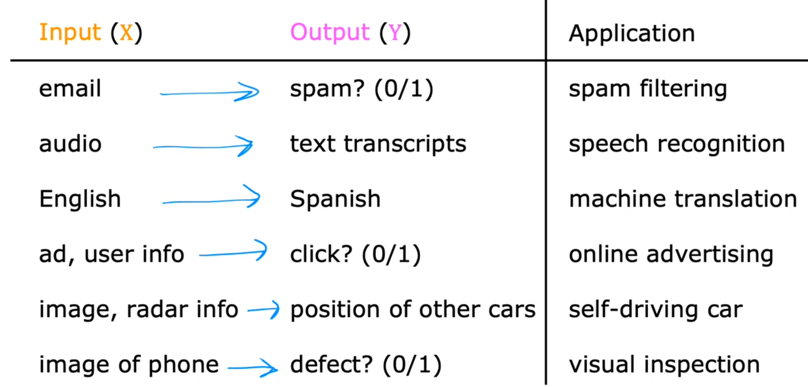

# 监督学习与非监督学习

## 什么是机器学习

对于机器学习的两种定义：

* "the field of study that gives computers the ability to learn without being explicitly programmed."    - Arthur Samuel
* "A computer program is said to learn from experience E with respect to some class of tasks T and performance measure P, if its performance at tasks in T, as measured by P, improves with experience E."    - Tom Mitchell

任何机器学习问题可以归于两大类之一：  
- **监督学习（Supervised Learning）**  
- **无监督学习（Unsupervised Learning，或称非监督学习）**

当然，还有半监督学习、强化学习等，尚不在讨论范围内。

### 监督学习

监督学习使用有标签的数据集，其任务是学习一个模型，使模型能够对任意给定的输入，对其相应的输出做出一个好的预测。

监督学习问题被分为 **回归（Regression）** 和 **分类（Classification）** 问题：

分类问题：将输入变量映射到离散的类别中，即预测一个离散值；

回归问题：将输入变量映射到某个连续函数，即预测一个连续值。
![[AI/机器学习/assets/20250601222253.png]]
### 非监督学习

在非监督学习中，使用的数据集没有标签，不知道结果会是什么样子，但可以通过聚类的方式从数据中提取一个特殊的结构。
![[AI/机器学习/assets/20250601222534.png]]

