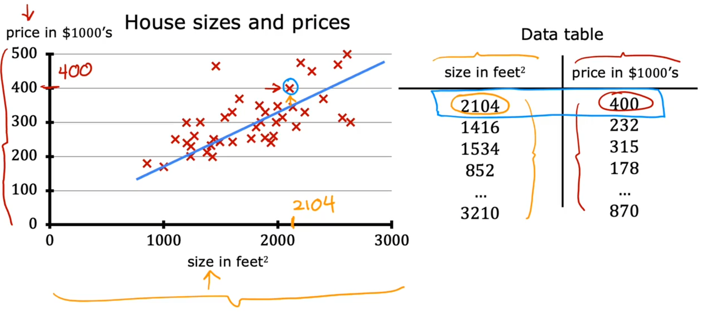
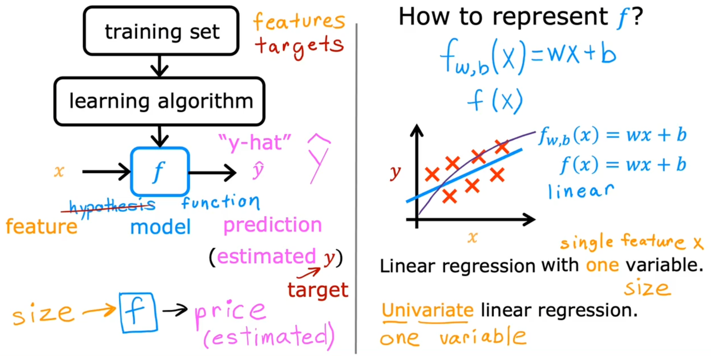
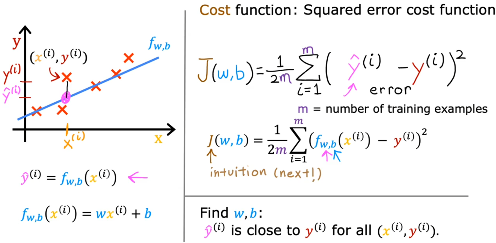
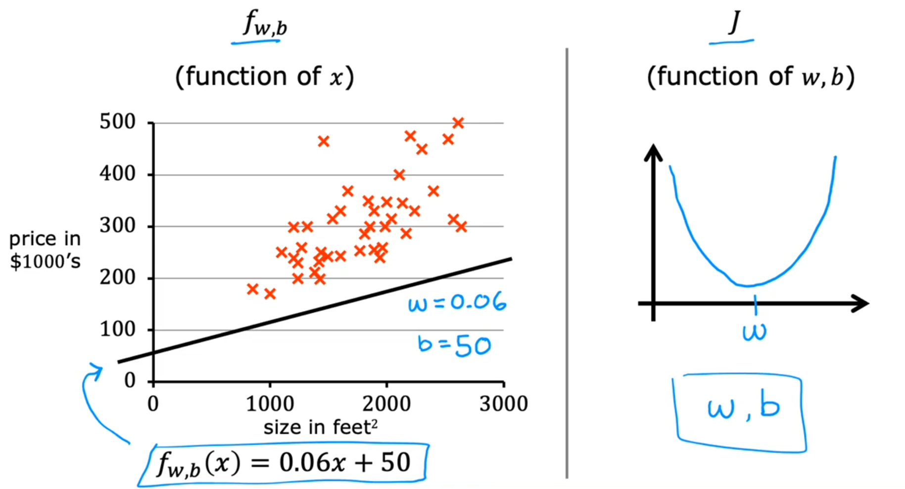
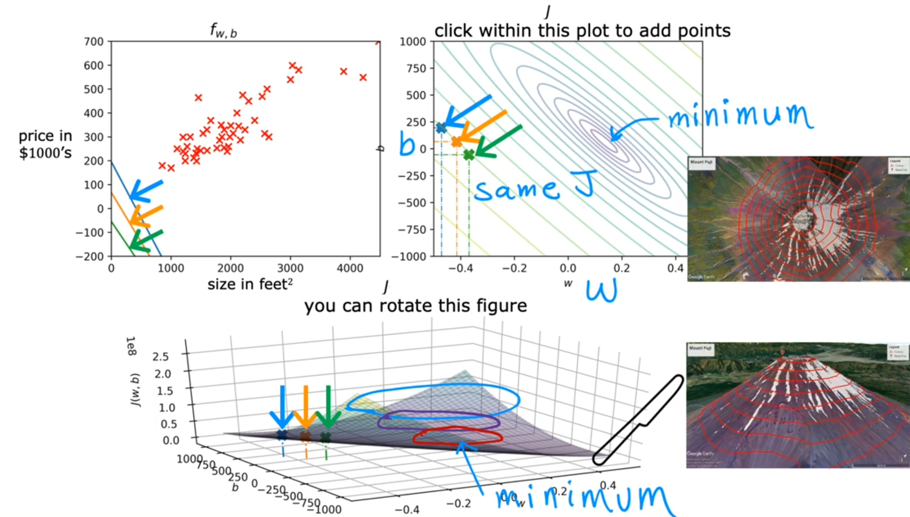

# 线性回归模型

## 假设函数

为了描述监督学习问题，我们的目标是，通过一个训练集，学习一个函数 $h : X \rightarrow Y$，使得 $h(x)$ 对于对应值 $y$ 是一个很好的预测器。$h(x)$ 被称为假设函数（hypothesis function）。

 $x$ 表示输入参数 (input feature) 
 $y$ 表示目标值 (target)
 $\hat{y}$ 表示预测值 (estimated)
$f$ 表示**假设函数** (hypathesis function)
$$f_{w,b}(x)=wx+b$$
如何确定模型中的参数取什么值? 用代价函数

## 代价函数

代价函数（Cost Function）是用来衡量预测值与实际值之间的误差。它的目的是找到一组参数，使得预测值与实际值之间的误差最小（确定最优参数）。评价模型是否拟合的准确，值越小，拟合的越准确。

**线性回归的代价函数**：最小二乘法。所谓“二乘”就是平方的意思。

$$J(w,b)=\frac{1}{2m}\sum_{i=1}^m\bigl(f_{w,b}\bigl(x^{(i)}\bigr)-y^{(i)}\bigr)^2$$
$f_{w,b}(x^{(i)})$ 中的$i$ 表示第$i$项, 即为 $\hat{y}^{(i)}$, 那么 $\hat{y}^{(i)} - y^{(i)}$ 表示预测值与实际值的误差, 平方用于放大误差,  将所有项累加起来得到误差和, 除 $m$ 得到平局误差,  $1/2m$ 中的 2 仅仅是为了后续求导计算简化计算步骤

$\bigr(f_{w,b}\bigl(x^{(i)}\bigr)-y^{(i)}\bigr)^2$ 部分又 叫损失函数（Loss Function）用 $L$ 表示
$$L=(f_{w,b}\bigl(x^{(i)}\bigr)-y^{(i)}\bigr)^2$$
损失函数衡量的是你在一个训练样例上的表现如何，它是通过总结你随后获得的所有训练样列的损失；而代价函数衡量你在整个训练集上的表现。

## 梯度下降（Gradient descent ）

从代价函数图中找到最小值所在的点。有没有一种算法可以自动地、快速求出使得代价函数最小的点呢？有，那就是**梯度下降**

- 梯度下降的工作是找到希望最小化代价函数J的参数w和b

- 如何快速到达最优点：从山顶一步一步走到山谷，先在原地转一圈，选最陡的地方走一步，在转一圈，在选最陡的一步。这一步一步就是多个梯度下降的步骤。

- 不同的w，b值决定你在那个位置

- 梯度下降算法  

$$
\begin{aligned}
w &= w - \alpha \frac {d_{J(w,b)}}{d_w}\\ 
b &= b - \alpha \frac {d_{J(w,b)}}{d_b}
\end{aligned}
$$

- 梯度下降（Gradient descent ）**同时更新** w，b。同时更新目的在于，能够确保是在原点寻找最陡方向。赋值就像迈出了一步，先迈出左脚寻找最陡的地方和在原地寻找最陡的地方不一样。

左侧为同时更新 w b，同一个w用到两个公式上；右侧即为错误更新，不是同时更新，此处先更新w，在将更新后的w值带入b公式中

- α学习率决定你迈出的一步有多大

- 导数决定梯度下降方向，学习率决定步长

### 理解梯度下降

为什么这个学习率和导数相乘时，会导致参数w和b的更新？

$\frac {d_{J(w,b)}}{d_w}$ 会有正负，

### 算法详解

梯度下降的具体算法实现过程是：

1. 确定模型的假设函数和损失函数
2. 相关参数的初始化，包括：参数、算法终止距离和步长
3. 确定当前位置损失函数的梯度
4. 用步长乘以梯度，得到当前位置下降的距离
5. 确定是否所有参数梯度下降的距离都小于算法终止距离，如果小于则算法终止，否则进行下一步
6. 更新所有参数，更新完毕转到步骤1

### 线性回归的梯度下降
$$\begin{aligned}
w&=w-\alpha\frac{1}{m}\sum_{i=1}^{m}(f_{w,b}\big(x^{(i)}\big)-y^{(i)})x^{(i)}\\
b &=b-\alpha\frac{1}{m}\sum_{i=1}^{m}(f_{w,b}(x^{(i)})-y^{(i)})
\end{aligned}$$
