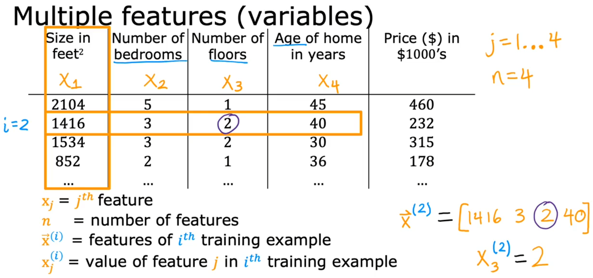
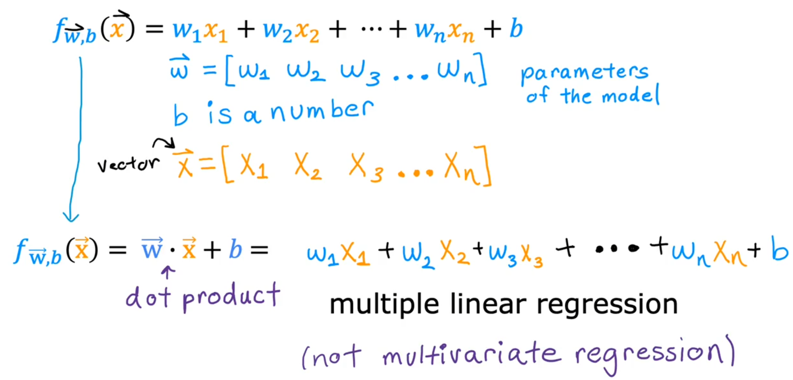

# 多元线性回归模型

## 多元假设函数

$m$ ：表示训练样本的数量, 即有多少行  
$n$ ：表示每个样本的特征数据, 即几有多少列  
$\vec{x}^{(i)}$：第 $i$ 个训练样本的所有特征  
$x_j^{(i)}$：第 $i$ 个训练样本的特征 $j$ 的值  

则多项式的假设函数为：

$$f_{w,b}(x) = w_1 x_1 + w_2 x_2 + w_3 x_3 + ... + w_n x_n + b $$

用向量表示法, 上式可以简写为：

$$f_{\vec{w},b}(\vec{x}) = 
[w_1 w_2 ... w_n ] 
\left[\begin{matrix} x_0 \\\ x_1 \\\ ...\\\ x_n \end{matrix}\right] + b 
= \vec{w} \cdot \vec{x} + b $$ 
## 多元损失函数

$$
J_{\vec{w},b} = \frac{1}{2m}\sum_{i=1}^m\bigl(f_{\vec{w},b}(\vec{x}^{(i)}\bigr)-y^{(i)}\bigr)^2$$

## 多元的梯度下降

$$\begin{align*}
\text{repeat} \ \{ \\
\quad w_j &= w_j - \alpha \frac{\partial}{\partial w_j} J(\vec{w}, b) \\
\quad b &= b - \alpha \frac{\partial}{\partial b} J(\vec{w}, b) \\
\}
\end{align*}$$

定义变量说明
给定 $n$ 个特征（$n \geq 2$），使用梯度下降法迭代更新参数：

$$
\text{repeat} \left\{
\begin{aligned}
w_1 &:= w_1 - \alpha \cdot \frac{1}{m} \sum_{i=1}^{m} \left( f_{\bm{w}, b}(\bm{x}^{(i)}) - y^{(i)} \right) x_1^{(i)} \\
&\vdots \\
w_n &:= w_n - \alpha \cdot \frac{1}{m} \sum_{i=1}^{m} \left( f_{\bm{w}, b}(\bm{x}^{(i)}) - y^{(i)} \right) x_n^{(i)} \\
b &:= b - \alpha \cdot \frac{1}{m} \sum_{i=1}^{m} \left( f_{\bm{w}, b}(\bm{x}^{(i)}) - y^{(i)} \right)
\end{aligned}
\right.
$$

其中，模型的预测函数为：

$$
f_{\bm{w}, b}(\bm{x}) = \bm{w}^\top \bm{x} + b
$$

每次迭代同时更新所有参数 $w_j \ (j = 1,\dots,n)$ 和偏置 $b$。

### 实践中的梯度下降 - 特征缩放

可以通过使每个输入值在大致相同的范围内来加速梯度下降。这是因为梯度在小范围内下降快，而在大范围内下降较慢；另外，对于不平整的变量，梯度在下降至最优值的过程中会出现降低效率的震荡。

因此将**特征缩放（feature scaling）**和**均值归一化（mean normalization）**两种技术结合使用。**特征缩放**将输入值除以输入变量的范围（即最大值减去最小值），从而得到一个大小为 1 的新范围；**均值归一化**涉及从输入变量的值减去输入变量的平均值，从而导致输入变量的新平均值为 0。公式为：

$$x\_i := \frac{x\_i - \mu\_i}{s\_i}$$

其中，$\mu\_i$ 是特征 $i$ 所有值的平均值，$s\_i$ 是特征 $i$ 的范围（最大值减最小值）。

### 实践中的梯度下降 - 学习率

当学习率 $\alpha$ 太小，则梯度下降太慢；而当学习率 $\alpha$ 太大，则梯度可能不会下降，也因此不会收敛。因此有时需要观察并进行调整。

## 参数计算

### 正规方程

梯度下降是最小化 $J$ 的一种方法。第二种方法是**正规方程（Normal Equation）**，它显式地执行最小化，而不使用迭代式的算法。

$$\theta = (X^TX)^{-1}X^Ty$$

正规方程方法中，无需做特征缩放。两种方法的对比如下：

| 梯度下降 | 正规方程 |
| :--: | :--: |
| 需要选择学习率 | 不需要选择学习率 |
| 需要多次迭代 | 不需要迭代 |
| $O(kn^2)$ | $O(n^3)$，需要计算 $(X^TX)^{-1}$ |
| 当 n 较大时效果很好 | 当 n 较大时速度较慢 |

不过正规方程方法要求 $X^TX$ 可逆。$X^TX$ 不可逆的原因有两种可能：

1. 列向量线性相关：即训练集中存在冗余特征（特征线性依赖），此时应该剔除掉多余特征；
2. 特征过多（多于样本数量）：此时应该去掉影响较小的特征，或引入正则化（regularization）项。

### 正规方程的推导过程

把数据集表示为矩阵

$$X = \left( \begin{matrix} x\_{11} & x\_{12} & \cdots & x\_{1d} & 1 \\\ x\_{21} & x\_{22} & \cdots & x\_{2d} & 1 \\\ \vdots & \vdots & \ddots & \vdots & \vdots \\\ x\_{m1} & x\_{m2} & \cdots & x\_{md} & 1 \\\ \end{matrix} \right) = \left( \begin{matrix} x\_{1}^T & 1 \\\ x\_{2}^T & 1 \\\ \vdots & \vdots \\\ x\_{m}^T & 1 \\\ \end{matrix} \right)$$

同时将标签也写成向量形式

$$y = (y\_1;y\_2;...;y\_m)$$

由均方误差最小化，可得

$$\theta^* = arg\_{\theta}min(y-X\theta)^T(y-X\theta)$$

其中，$\theta^*$表示 $\theta$ 的解。

令

$$E\_{\theta} = (y-X\theta)^T(y-X\theta)$$

对 $\theta$ 求导得到

$$
\begin{equation}
\begin{split}
\frac{\partial E\_{\theta}}{\partial \theta}&=-X^T(y-X\theta) + (y^T - \theta^TX^T) \cdot (-X)\\\
&=2X^T(X\theta - y)
\end{split}
\end{equation}
$$

令上式为 0，有

$$2X^T(X\theta - y) = 0$$

$$X^TX\theta = X^Ty$$

最终得到

$$\theta = (X^TX)^{-1}X^Ty$$

当 $X^TX$ 不为满秩矩阵（不可逆）时，可解出多个 $\theta$ 使均方误差最小化。因此将由学习算法的归纳偏好来决定选择哪一个解作为输出，常见的做法就是引入正则化项。