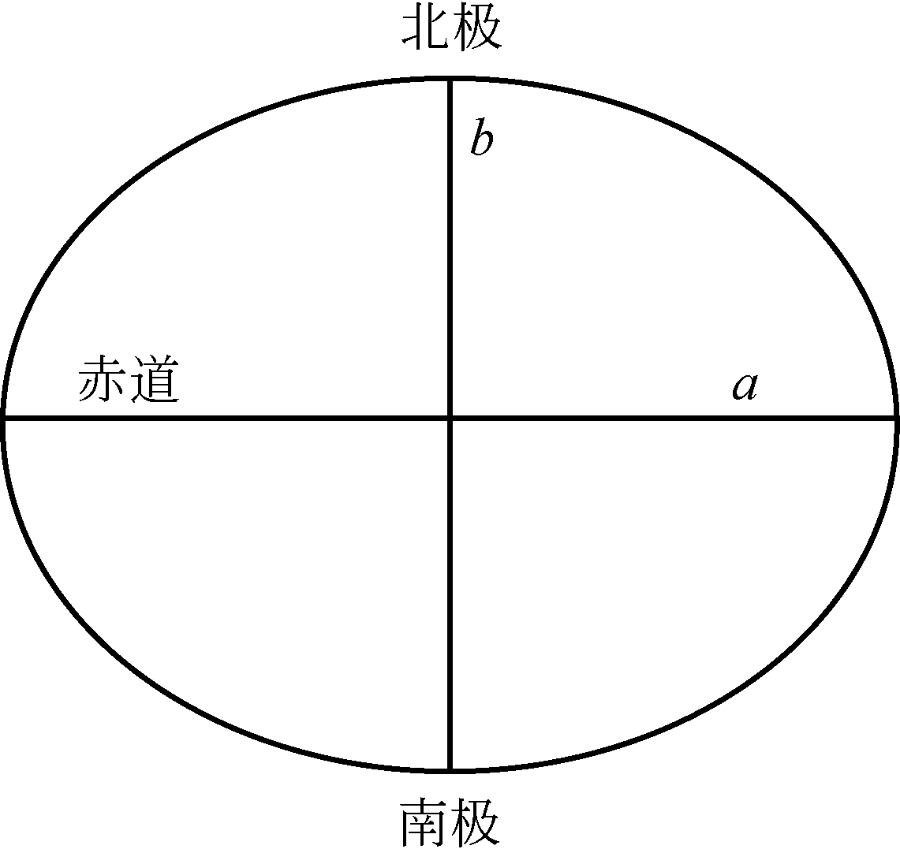

### 空间参考系
参考系用于描述物体在空间中的相对位置的基准，要在一起使用的图层必须在空间上相互匹配，否则就会发生明显错误。 


### 大地水准面

等重力面，与海平面重合并延伸到大陆内部的水准面。

重力作用下假设全球海水延伸到陆地以下形成封闭曲面，这个面上重力值相等。

大地水准面（Geoid）也是经常出现的一个概念，就是椭球体吧。
大地水准面是海洋表面在排除风力、潮汐等其它影响，只考虑重力和自转影响下的形状，这个形状延伸过陆地，生成一个密闭的曲面。
虽然前面说了地球是一个椭球体，但是这个椭球体的表示是凹凸不平的，由于地球各部分的密度不同，引力分布不均，大地水准面是一个不规则的光滑曲面。
大地水准面是一个假想的、与地球海洋平均海平面一致并在全球范围内延伸的“等重力面”。它代表了“重力等位”的真实海拔基准。


### 参考椭球面（Reference Ellipsoid）


### 

### 似大地水准面

### 大地基准


地球是椭圆的，。。。。 这引入了地理坐标系统。

地球是椭圆的，但人们通常需要在平面上对地图进行作业，需要经纬度坐标球面坐标系统转换到x 轴和 y 轴表示的平面坐标系统，由地理坐标变换到投影坐标。

### 地理坐标系统
地理坐标系统是由经度和纬度定义，均角度表示。

经度是从本初子午线开始向东或向西量度角度，而纬度是从赤道平面向北或向南量度角度的。

子午线是指经度相同的线。

本初子午线经过英格兰的格林尼治，经度为 0°。以本初子午线为参照，我们可以从本初子午线开始向东或向西在 0°～180°测量地球表面某个地点的经度值。因此，子午线用于东-西位置的度量。

纬线是指纬度相同的线。以赤道为 0°纬度，我们可以从赤道向南或向北在 0°～90°测量纬度值。显然纬线用于测量南北方向的位置。地球表面某点位置为 120°W60°N，表示其位于本初子午线以西120°，赤道以北 60°。

本初子午线和赤道被看作是地理坐标系统的基线。

经线和纬线的角度可以用度-分-秒（DMS）、十进制表示的度数（DD），或者是弧度（rad）的形式表示。1 度等于 60 分，1 分等于 60 秒，我们可以在 DMS 和 DD 之间进行转换。例如，纬度值 45°52′30″等于 45.875°（45 + 52/60 + 30/3600）。弧度一般在计算机编程中应用。1 弧度等于 57.2958°，1 度等于 0.01745 弧度。


地理坐标系统是一个球面坐标系统，第一步是选择一个与地球形状、大小接近的模型。最简单的模型就是球体。

## 参考椭球体（Reference Ellipsoid）
但是地球并不是一个纯粹的球体：地球的赤道比两极之间宽一些。因此，与地球形状比较接近的是一个以椭圆短轴旋转而成的扁球，也称为椭球体。

参考椭球体是用来近似描述地球形状的一个规则数学模型，是旋转椭球体。

椭球体有与赤道相连的长轴（a）和与极点相接的短轴（b），参数扁率（f）用于测量椭球体两轴的差异，公式为（a–b）/a。



基于椭球体的地理坐标被称为大地坐标，或成为地理坐标。


## 大地基准（Datum）
大地基准面是用于定义地理坐标系统（如经纬度）的参考基础，包括：

- 参考椭球体：如 克拉索夫斯基椭球体、GRS80 椭球体等
- 地方基准面：局部基准点如西安、地球质量中心（地心系）等

是把椭球“放”在地球上的一种方式，决定椭球的位置、方向和零点。这个过程依赖于一些基准点来控制。


椭球体与地球中心或表面的定位方式。

大地基准是地球的数学模型，它是计算水平基准时的地理坐标的参照或基础，并用于计算垂直海拔高度。
水平基准的定义包括起始点（原点）的经度和纬度、椭球体及椭球体与地球在原点的分离。因此，基准面和椭球面是密切相关的。


真实地球表面
│
├─ 大地水准面（等重力面）——真实“海拔”的参考
│
├─ 大地基准面（Datum）= 椭球体 + 与地球对齐方式
│    └─ 椭球体（数学模型）用来定义地理坐标系统（经纬度）

| 项目   | 北京54 / 西安80      | CGCS2000                |
| ---- | ---------------- | ----------------------- |
| 椭球体  | 克拉索夫斯基椭球体        | GRS80 椭球体（与 WGS84 基本一致） |
| 基准点  | 地区本地控制点（普尔科沃、西安） | 地球质量中心（地心系）             |
| 定位方式 | 本地拟合             | 全球拟合，基于 GNSS 数据         |
| 精度   | 局部精度高，全球精度差      | 全球统一，兼容 GPS 等系统         |

如何实现拟合？
第一步：选择一个参考椭球体。
如：Krassovsky 1940、GRS80、WGS84。这些定义了：
- 长半轴（a）
- 扁率（f）

第二部： 收集多个高精度的基准点数据
这些控制点要具备：
- 实际观测值（天文纬度、经度、大地高）
- 对应的大地水准面值（如水准测量海拔）

#### 两种拟合方式：

| 拟合方式                       | 描述                                             |
| -------------------------- | ---------------------------------------------- |
| **本地拟合（Local Datum）**      | 调整椭球中心和方向，使它在某一区域（如中国）与当地大地水准面最接近。例如：西安80、北京54 |
| **地心拟合（Geocentric Datum）** | 椭球以地球质心为中心，不再针对局部优化，如：WGS84、CGCS2000           |
#### 本地拟合使用的数学工具：

- 平移：调整椭球中心位置（X、Y、Z）
  
- 旋转：微调椭球的姿态（α、β、γ）
  
- 缩放：极小比例因子修正（μ）  
    👉 合称为“**七参数拟合**”

七参数转换公式（简化）
用于将“地心直角坐标（X, Y, Z）”从一个大地基准（如西安80）转换到另一个（如CGCS2000）：
```
X2 = X1 + dx + μ·X1 + (γ·Y1 - β·Z1)
Y2 = Y1 + dy + μ·Y1 + (-γ·X1 + α·Z1)
Z2 = Z1 + dz + μ·Z1 + (β·X1 - α·Y1)
```

其中：

- dx, dy, dz = 平移参数
  
- α, β, γ = 三轴旋转角
  
- μ = 尺度因子


参心坐标系  

地心坐标系  

