变换的内容主要包括:

- 线性变换(缩放,旋转) 
- 罗德里格旋转公式 
- 仿射变换 
- 视图变换 
- 投影变换 

核心是MVP变换.

## 缩放

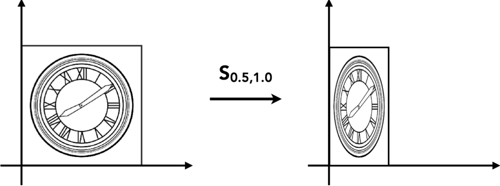

缩放是指点 $(x_0, y_0)$ 经过缩放因子 $S_{x}, S_{y}$ 变换之后形成新的点 $(x_1, y_1)$ , 写成矩阵的形式就是：

$$ \begin{bmatrix} x_1 \\ y_1 \end{bmatrix} = \begin{bmatrix} S_{x} & 0 \\ 0 & S_{y} \end{bmatrix} \begin{bmatrix} x_0 \\ y_0 \end{bmatrix} $$

## 旋转

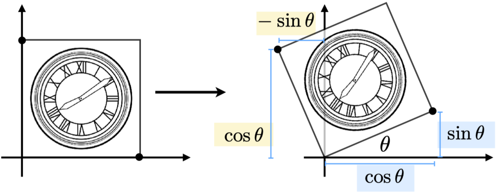

旋转是指围绕某个中心点旋转角度 $\theta$ 的变换, 如图一个正方形围绕原点旋转了角度 $\theta$, 假设正方形的边长为 1，可以推导出以下关系: 

首先，一般的二维线性变换形式为：

$$ \begin{bmatrix} x_1 \\ y_1 \end{bmatrix} = \begin{bmatrix} A & B \\ C & D \end{bmatrix} \begin{bmatrix} x_0 \\ y_0 \end{bmatrix} $$

**对点 (1,0) 的变换**

对于右下角的点，变换前的坐标为 $(1, 0)$，变换后的坐标为 $(\cos\theta, \sin\theta)$，因此有：

$$ \begin{bmatrix} \cos\theta \\ \sin\theta \end{bmatrix} = \begin{bmatrix} A & B \\ C & D \end{bmatrix} \begin{bmatrix} 1 \\ 0 \end{bmatrix} $$

通过矩阵乘法可以得到：

$$ \cos\theta = A \times 1 + B \times 0 = A $$

**对点 (0,1) 的变换**

对于左上角的点，变换前的坐标为 $(0, 1)$，变换后的坐标为 $(-\sin\theta, \cos\theta)$，因此有：

$$ \begin{bmatrix} -\sin\theta \\ \cos\theta \end{bmatrix} = \begin{bmatrix} A & B \\ C & D \end{bmatrix} \begin{bmatrix} 0 \\ 1 \end{bmatrix} $$

通过矩阵乘法可以得到：

$$ -\sin\theta = A \times 0 + B \times 1 = B $$

$$ \cos\theta = C \times 0 + D \times 1 = D $$

由此确定了 $B = -\sin\theta$ 和 $D = \cos\theta$。

因此，我们得到旋转矩阵：

$$ R_\theta = \begin{bmatrix} \cos\theta & -\sin\theta \\ \sin\theta & \cos\theta \end{bmatrix} $$

## 线性变换

缩放和旋转都能以矩阵的形式来表示，即：

$$ \begin{bmatrix} x_1 \\ y_1 \end{bmatrix} = \begin{bmatrix} A & B \\ C & D \end{bmatrix} \begin{bmatrix} x_0 \\ y_0 \end{bmatrix} $$

如果变换可以通过以矩阵 $M$ 与点相乘然后得到一个新的点的话，那么这种变换就可以称为是线性变换。

## 平移

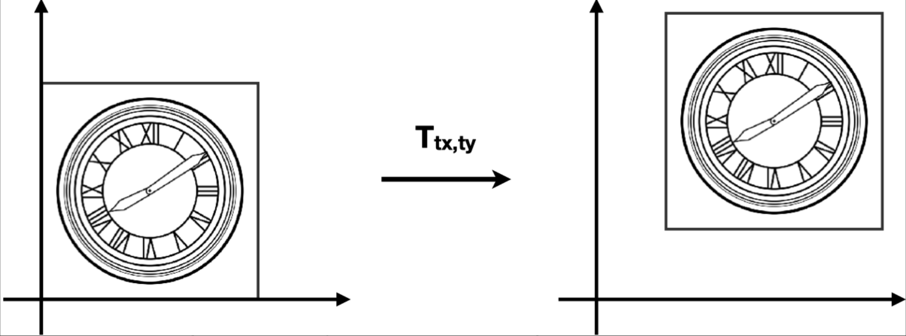

平移就是把 $(x, y)$ 移动一段距离 $(T_x, T_y)$ 然后得到一个新的坐标，即：

$ x_1 = x_0 + T_x $

$ y_1 = y_0 + T_y $

## 齐次坐标

与缩放和旋转不同，平移不能直接用一个简单的矩阵乘法来表示。平移的一般形式为：

$$ \begin{bmatrix} x_1 \\ y_1 \end{bmatrix} = \begin{bmatrix} A & B \\ C & D \end{bmatrix} \begin{bmatrix} x_0 \\ y_0 \end{bmatrix} + \begin{bmatrix} T_x \\ T_y \end{bmatrix} $$

为了统一所有变换（包括平移、旋转、缩放），我们引入了齐次坐标。

齐次坐标为点和向量添加了一个 $w$ 分量：

- **对于 2D 点**：$(x, y)$ 变为 $(x, y, 1)$
- **对于 2D 向量**：$(x, y)$ 变为 $(x, y, 0)$

>**为什么要添加 $w$ 分量？**
>
>在普通坐标中，点用 $(x, y)$ 表示位置，向量也用 $(x, y)$ 表示方向和大小。但它们有一个重要区别：
>
>- **点**：表示空间中的一个**位置**，平移会改变点的位置
>- **向量**：表示**方向**和**大小**，平移不应该改变向量
>
>为了区分点和向量，也为了统一所有变换（平移、旋转、缩放），我们添加第三个分量 $w$：
>
>- **$w = 1$**（点）：表示这是一个位置，会受到平移变换的影响
>- **$w = 0$**（向量）：表示这是一个方向，不受平移变换的影响
>
>例如：  
>
>- 点 $P = (3, 4)$ 在齐次坐标中表示为 $(3, 4, 1)$  
>- 向量 $\vec{v} = (2, 1)$ 在齐次坐标中表示为 $(2, 1, 0)$  
>

通过添加 $w$ 分量，包含平移在内的所有变换都可以写成单一的矩阵乘法：

$$ \begin{bmatrix} x_1 \\ y_1 \\ w_1 \end{bmatrix} = \begin{bmatrix} A & B & T_x \\ C & D & T_y \\ 0 & 0 & 1 \end{bmatrix} \begin{bmatrix} x_0 \\ y_0 \\ w_0 \end{bmatrix} $$

在齐次坐标下，一个矩阵可以同时表示平移、旋转和缩放。

向量具有平移不变性。当 $w = 0$ 时，平移矩阵确保 $w$ 分量在乘法后仍然为 0。

例如，对向量应用平移矩阵：  

$$ \begin{bmatrix} x_1 \\ y_1 \\ w_1 \end{bmatrix} = \begin{bmatrix} 1 & 0 & T_x \\ 0 & 1 & T_y \\ 0 & 0 & 1 \end{bmatrix} \begin{bmatrix} x_0 \\ y_0 \\ 0 \end{bmatrix} = \begin{bmatrix} x_0 + T_x \\ y_0 + T_y \\ 0 \end{bmatrix} $$

由于 $w = 0$，向量不会受到平移的影响，这符合向量只有方向和大小的特性。

基于齐次坐标中点和向量 $w$ 分量的不同，我们可以总结出以下运算规律：

- **向量 + 向量 = 向量**
    - 因为 $w_1 + w_2 = 0 + 0 = 0$
- **点 - 点 = 向量**
    - 因为 $w_1 - w_2 = 1 - 1 = 0$，所以点 - 点 = 向量。
- **点 + 向量 = 点**
    - 因为 $w_1 + w_2 = 1 + 0 = 1$，所以点 + 向量 = 点。
- **点 + 点 = 两点的中点**
    - 因为 $w_1 + w_2 = 1 + 1 = 2$，在齐次坐标中，点的 $w$ 分量为 1，所以结果需要除以 2 才能得到正确的中点位置。

## 逆变换

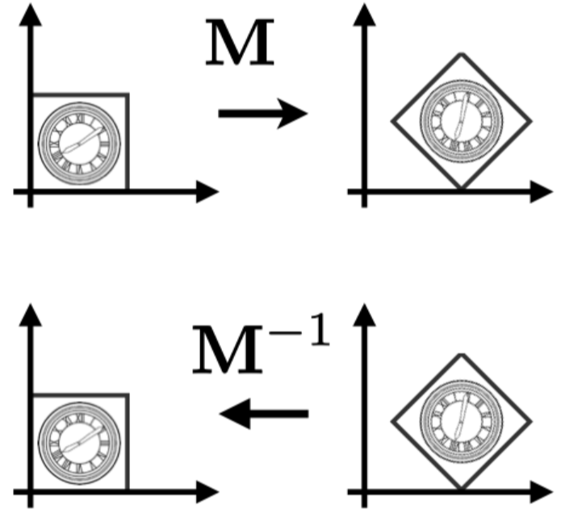

逆变换是指把已应用的变换还原的变换，在数学上是指变换矩阵的逆矩阵 $M^{-1}$。

如果我们对一个点应用变换矩阵 $M$ 得到变换后的点，那么应用逆矩阵 $M^{-1}$ 就可以将变换后的点还原回原来的位置。

例如，对于一个变换：

$$ \begin{bmatrix} x_1 \\ y_1 \end{bmatrix} = M \begin{bmatrix} x_0 \\ y_0 \end{bmatrix} $$

其逆变换为：

$$ \begin{bmatrix} x_0 \\ y_0 \end{bmatrix} = M^{-1} \begin{bmatrix} x_1 \\ y_1 \end{bmatrix} $$

因此有：

$$ M^{-1} M = I $$

其中 $I$ 是单位矩阵，表示不进行任何变换。

**逆变换的应用：**

- **旋转的逆变换**：如果旋转了角度 $\theta$，逆变换就是旋转角度 $-\theta$
- **缩放的逆变换**：如果缩放了 $S_x, S_y$，逆变换就是缩放 $1/S_x, 1/S_y$
- **平移的逆变换**：如果平移了 $(T_x, T_y)$，逆变换就是平移 $(-T_x, -T_y)$

## 仿射变换

**仿射变换 = 线性变换 + 平移**

仿射变换是线性变换和平移的组合。在标准 2D 坐标中，仿射变换可以表示为：

$$ \begin{bmatrix} x_1 \\ y_1 \end{bmatrix} = \begin{bmatrix} A & B \\ C & D \end{bmatrix} \begin{bmatrix} x_0 \\ y_0 \end{bmatrix} + \begin{bmatrix} T_x \\ T_y \end{bmatrix} $$

其中 $\begin{bmatrix} A & B \\ C & D \end{bmatrix}$ 是线性变换矩阵，$\begin{bmatrix} T_x \\ T_y \end{bmatrix}$ 是平移向量。

使用齐次坐标，仿射变换可以统一表示为单一的矩阵乘法：

$$ \begin{bmatrix} x_1 \\ y_1 \\ 1 \end{bmatrix} = \begin{bmatrix} A & B & T_x \\ C & D & T_y \\ 0 & 0 & 1 \end{bmatrix} \begin{bmatrix} x_0 \\ y_0 \\ 1 \end{bmatrix} $$


使用齐次坐标表示仿射变换有以下优势：

1. **可以用一个矩阵来表示平移、旋转、缩放三种变换**
2. **逆变换可以通过逆矩阵来表示**

在齐次坐标下，各种变换的矩阵表示为：

**平移矩阵** $T(T_x, T_y)$：

$$ T(T_x, T_y) = \begin{bmatrix} 1 & 0 & T_x \\ 0 & 1 & T_y \\ 0 & 0 & 1 \end{bmatrix} $$

**旋转矩阵** $R(\theta)$：

$$ R(\theta) = \begin{bmatrix} \cos\theta & -\sin\theta & 0 \\ \sin\theta & \cos\theta & 0 \\ 0 & 0 & 1 \end{bmatrix} $$

**缩放矩阵** $S(S_x, S_y)$：

$$ S(S_x, S_y) = \begin{bmatrix} S_x & 0 & 0 \\ 0 & S_y & 0 \\ 0 & 0 & 1 \end{bmatrix} $$


在仿射变换下，变换的先后顺序是**先进行线性变换，然后再进行平移变换**。

这意味着如果我们应用变换矩阵 $M$，它先对点应用线性变换部分（旋转、缩放等），然后再应用平移部分。

## 组合变换

矩阵乘法没有交换律，所以两种变换是不能调换顺序的。即先平移再旋转并不等于先旋转再平移的结果。因此，**应用变换的顺序很重要**。

而在应用变换的时候，是根据**从右往左的顺序**来进行的。

例如：

$$ T \cdot R \cdot \begin{bmatrix} x \\ y \\ 1 \end{bmatrix} $$

上面这个变换表示**先进行旋转，然后再进行平移**。

矩阵乘法满足结合律，因此有：

$$ A_n(\cdots A_2(A_1 \cdot \begin{bmatrix} x \\ y \\ 1 \end{bmatrix})) = A_n \cdots A_2 \cdot A_1 \cdot \begin{bmatrix} x \\ y \\ 1 \end{bmatrix} $$

观察右边的式子，我们可以预先计算 $T = A_n \cdots A_2 A_1$，然后直接 $T \cdot [x \; y \; 1]^T$ 即可。这是一种优化计算的手段。

## 分解复杂变换

有时候我们需要围绕一个不是原点的点进行旋转。例如，围绕任意点 $(c_x, c_y)$ 旋转角度 $\theta$。

这可以通过三个步骤来完成：

1. **将旋转中心平移到原点**：使用平移矩阵 $T(-c_x, -c_y)$
2. **进行旋转**：使用旋转矩阵 $R(\theta)$
3. **将旋转中心平移回原位置**：使用平移矩阵 $T(c_x, c_y)$

完整的变换矩阵为：

$$ T(c_x, c_y) \cdot R(\theta) \cdot T(-c_x, -c_y) $$

这种分解方法可以让我们通过组合基本变换（平移、旋转、缩放）来实现更复杂的变换。

## 三维变换

三维变换与二维变换类似，只是增加了一个 $z$ 维度。

三维齐次坐标：

- **3D 点**：$(x, y, z)$ 在齐次坐标中表示为 $(x, y, z, 1)$
- **3D 向量**：$(x, y, z)$ 在齐次坐标中表示为 $(x, y, z, 0)$

如果一个齐次坐标为 $(x, y, z, w)$，其中 $w \neq 0$，那么它表示的三维点的笛卡尔坐标为 $(x/w, y/w, z/w)$。

使用齐次坐标，三维变换可以用一个 4×4 矩阵表示：

$$ \begin{bmatrix} x_1 \\ y_1 \\ z_1 \\ 1 \end{bmatrix} = \begin{bmatrix} A & B & C & T_x \\ D & E & F & T_y \\ G & H & I & T_z \\ 0 & 0 & 0 & 1 \end{bmatrix} \begin{bmatrix} x_0 \\ y_0 \\ z_0 \\ 1 \end{bmatrix} $$

其中：
- 左上角的 3×3 子矩阵 $\begin{bmatrix} A & B & C \\ D & E & F \\ G & H & I \end{bmatrix}$ 表示线性变换（旋转、缩放等）
- 第四列的前三个元素 $(T_x, T_y, T_z)$ 表示平移
- 最后一行 $(0, 0, 0, 1)$ 是齐次坐标的标准形式

## 正交矩阵

在研究旋转矩阵时，我们发现了一个有趣的性质。

对于旋转角度 $\theta$ 的旋转矩阵：

$$ R_\theta = \begin{bmatrix} \cos\theta & -\sin\theta \\ \sin\theta & \cos\theta \end{bmatrix} $$

其逆矩阵（旋转角度 $-\theta$）为：

$$ R_{-\theta} = \begin{bmatrix} \cos(-\theta) & -\sin(-\theta) \\ \sin(-\theta) & \cos(-\theta) \end{bmatrix} = \begin{bmatrix} \cos\theta & \sin\theta \\ -\sin\theta & \cos\theta \end{bmatrix} $$

旋转矩阵 $R_\theta$ 的转置为：

$$ R_\theta^T = \begin{bmatrix} \cos\theta & \sin\theta \\ -\sin\theta & \cos\theta \end{bmatrix} $$

我们注意到：$R_{-\theta} = R_\theta^T$，即**旋转矩阵的逆矩阵等于其转置矩阵**。

这个性质可以用来求旋转矩阵的逆矩阵：只需要计算转置即可，这比一般的矩阵求逆运算要简单得多。

如果一个矩阵的逆矩阵等于其转置矩阵，即 $M^{-1} = M^T$，那么这个矩阵称为**正交矩阵**。因此，旋转矩阵是一种正交矩阵。

## MVP变换

- **模型变换 (Model Transformation)**
- **视图变换 (View Transformation)**
- **投影变换 (Projection Transformation)**
    - 正交投影 (Orthographic Projection)
    - 透视投影 (Perspective Projection)

> 如何理解MVP变换?
想象一下拍照的过程,拍照就是一个把三维转化为二维的操作：
- 找一个风景好的地方, 把人安排好
- 确定相机的摆放, 选好角度和位置
- 按下快门, 得到一张二维的照片

### 模型变换(Model Transformation)

对物体进行变换, 比如旋转, 缩放, 平移等.

### 视图变换 (View Transformation)

摄像机与物体的相对距离，会影响最终图像的效果。换句话说，无论是移动物体还是移动摄像机，只要保持两者的相对距离不变，那么我们就能得到相同的图像。

因此，我们可以把摄像机放到原点位置，朝向 $-Z$ 方向，其他物体与摄像机保持相对位置不变，我们就能得到与世界空间下拍摄到的一样的图像了。

视图变换是用来把世界空间变换成摄像机空间。如下图所示：

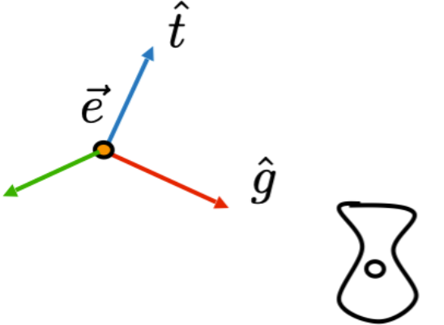

世界空间

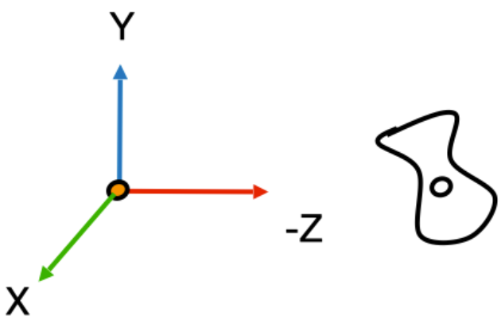

摄像机空间

要确定视图变换，需要三个变量：

1. **摄像机的位置** (Camera position)
2. **目标位置** (Target position)
3. **摄像机的上方向** (Camera's up direction)

将摄像机从世界空间变换到视图空间的步骤如下：

1. **把摄像机移动到原点**：使用平移矩阵
2. **把摄像机的 上方向 调整成与 Y 一致，并让摄像机往 -Z 方向看**：使用旋转矩阵

视图变换矩阵表示为：

$$ M_{view} = R_{view} \cdot T_{view} $$

#### 平移矩阵 $T_{view}$ 的推导

假设摄像机在世界坐标系中的位置为 $(x, y, z)$，则平移矩阵为：

$$ T_{view} = \begin{bmatrix} 1 & 0 & 0 & -x \\ 0 & 1 & 0 & -y \\ 0 & 0 & 1 & -z \\ 0 & 0 & 0 & 1 \end{bmatrix} $$

这个矩阵将摄像机从世界空间的原点移动到坐标原点。

#### 旋转矩阵 $R_{view}$ 的推导

假设摄像机的上方向为 $\hat{t}$，看向方向为 $\hat{g}$。

由于 $\hat{e}$、$\hat{t}$、$\hat{g}$ 构成摄像机的局部坐标系且相互正交，我们定义 $\hat{e} = \hat{g} \times \hat{t}$（其中 $\hat{e}$ 是右向量）。

$R_{view}$ 是将摄像机的局部坐标系旋转到标准笛卡尔坐标系的变换，直接计算比较复杂。

由于旋转矩阵是正交矩阵，我们可以利用其性质：先求 $R_{view}$ 的逆矩阵，然后通过转置得到 $R_{view}$。

**逆矩阵 $R_{view}^{-1}$：**

逆矩阵的列向量是摄像机局部坐标系的基向量在世界坐标系中的表示：

$$ R_{view}^{-1} = \begin{bmatrix} x_{g \times t} & x_t & x_{-g} & 0 \\ y_{g \times t} & y_t & y_{-g} & 0 \\ z_{g \times t} & z_t & z_{-g} & 0 \\ 0 & 0 & 0 & 1 \end{bmatrix} $$

其中：
- 第一列 $(x_{g \times t}, y_{g \times t}, z_{g \times t})$ 是 $\hat{e} = \hat{g} \times \hat{t}$ 的分量
- 第二列 $(x_t, y_t, z_t)$ 是上方向向量 $\hat{t}$ 的分量
- 第三列 $(x_{-g}, y_{-g}, z_{-g})$ 是负的看向方向 $-\hat{g}$ 的分量

**转置得到 $R_{view}$：**

由于旋转矩阵是正交矩阵，$R_{view} = (R_{view}^{-1})^T$，因此：

$$ R_{view} = \begin{bmatrix} x_{g \times t} & y_{g \times t} & z_{g \times t} & 0 \\ x_t & y_t & z_t & 0 \\ x_{-g} & y_{-g} & z_{-g} & 0 \\ 0 & 0 & 0 & 1 \end{bmatrix} $$

将 $R_{view}$ 和 $T_{view}$ 相乘，得到最终的视图变换矩阵：

$$ M_{view} = R_{view} \cdot T_{view} = \begin{bmatrix} x_{g \times t} & y_{g \times t} & z_{g \times t} & -x \\ x_t & y_t & z_t & -y \\ x_{-g} & y_{-g} & z_{-g} & -z \\ 0 & 0 & 0 & 1 \end{bmatrix} $$

其中最后一列的前三个元素是经过旋转后的摄像机位置的负值。

### 投影变换 (Projection Transformation)

投影矩阵的作用是把三维空间变换成二维空间，即图片。常见的投影有两种：

- 正交投影（不会出现近大远小的现象）
- 透视投影（会出现近大远小的现象，透视投影下的平行线最终会汇聚在一点）

#### 正交投影 (Orthographic Projection)

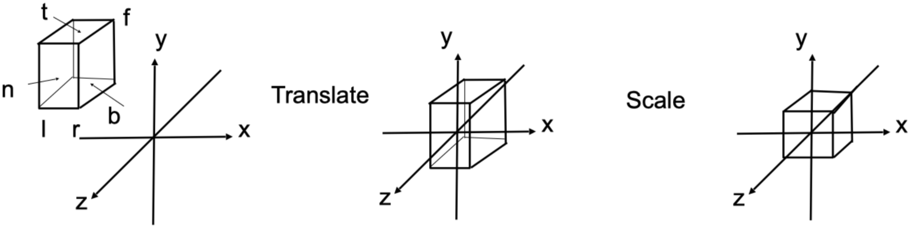

正交投影是把 $[l, r] \times [b, t] \times [f,n]$ 构成的空间压缩成 $[-1, 1]^3$ 的立方体中。

> **为什么一定要压缩成 $[-1, 1]^3$ 立方体？**
>
> 将任意大小的视景体压缩成标准的 $[-1, 1]^3$ 立方体有以下几个重要原因：
>
> 1. **标准化设备坐标 (NDC - Normalized Device Coordinates)**
>    - $[-1, 1]^3$ 是图形学中的**标准化设备坐标空间**，这是一个设备无关的坐标系
>    - 无论原始视景体的大小如何，经过投影后都统一到这个标准空间，便于后续处理
>
> 2. **硬件和API的标准化要求**
>    - OpenGL、DirectX 等图形API都使用这个标准化的坐标空间
>    - 不同的图形硬件都遵循这个约定，确保代码在不同平台上都能正常工作
>
> 3. **简化视口变换 (Viewport Transformation)**
>    - 投影后的坐标在 $[-1, 1]^3$ 中，后续只需要简单的线性映射就能将标准立方体映射到屏幕上的任意矩形区域
>    - 视口变换只需要将 $[-1, 1]$ 映射到 $[0, width] \times [0, height]$ 即可
>
> 4. **深度缓冲区的统一处理**
>    - Z坐标也被标准化到 $[-1, 1]$ 范围（或 $[0, 1]$，取决于API）
>    - 这样深度测试和深度缓冲区的工作方式在所有平台上都是一致的
>
> 5. **数学上的便利性**
>    - $[-1, 1]$ 范围对称，便于进行各种数学运算
>    - 后续的裁剪（clipping）操作也在这个标准空间中进行，算法更加统一

**参数定义：**
- $l$ = left（左）
- $r$ = right（右）
- $b$ = bottom（底）
- $t$ = top（顶）
- $n$ = near（近）
- $f$ = far（远）

> **注意**：因为摄像机是朝 -Z 方向的，所以 $n > f$。

**变换步骤：**

要确定正交投影矩阵，需要经过以下步骤：

1. **把空间平移到原点**（空间的中心与原点重合）
2. **把空间压缩成 $[-1, 1]^3$**

整体的正交投影矩阵表示为：

$$ M_{ortho} = S_{ortho} \cdot T_{ortho} $$

**平移矩阵 $T_{ortho}$ 的推导：**

由于我们知道空间的六个面，因此这个空间的中心就是：$\left(\frac{l+r}{2}, \frac{b+t}{2}, \frac{n+f}{2}\right)$，那么平移矩阵为：

$$ T_{ortho} = \begin{bmatrix} 1 & 0 & 0 & -\frac{r+l}{2} \\ 0 & 1 & 0 & -\frac{t+b}{2} \\ 0 & 0 & 1 & -\frac{n+f}{2} \\ 0 & 0 & 0 & 1 \end{bmatrix} $$

**缩放矩阵 $S_{ortho}$ 的推导：**

下一步就是压缩空间了，这一步骤相当于进行一次缩放，把当前空间缩放到大小为 2 的立方体。

以空间的 X 方向为例，其长度为 $r-l$，因此 X 方向的缩放因子就是：

$$ (r-l) \times S_x = 2 $$

解得：$S_x = \frac{2}{r-l}$

同理可求出 $S_y$ 和 $S_z$：

$$ S_y = \frac{2}{t-b} $$

$$ S_z = \frac{2}{n-f} $$

然后得到缩放矩阵：

$$ S_{ortho} = \begin{bmatrix} \frac{2}{r-l} & 0 & 0 & 0 \\ 0 & \frac{2}{t-b} & 0 & 0 \\ 0 & 0 & \frac{2}{n-f} & 0 \\ 0 & 0 & 0 & 1 \end{bmatrix} $$

**最终的正交投影矩阵：**

$$ M_{ortho} = S_{ortho} \cdot T_{ortho} = \begin{bmatrix} \frac{2}{r-l} & 0 & 0 & -\frac{r+l}{r-l} \\ 0 & \frac{2}{t-b} & 0 & -\frac{t+b}{t-b} \\ 0 & 0 & \frac{2}{n-f} & -\frac{n+f}{n-f} \\ 0 & 0 & 0 & 1 \end{bmatrix} $$

> **重要理解：投影区域的形状**
>
> 你可能会问：一个长方体压缩成立方体后，投影区域还是长方体吗？
>
> **答案是：这取决于我们讨论的是哪个阶段：**
>
> 1. **在NDC空间（标准化设备坐标空间）中**：
>    - 投影区域是**立方体** $[-1, 1]^3$
>    - X、Y、Z三个方向都被压缩到 $[-1, 1]$ 范围内
>    - 这是一个**3D空间**中的立方体
>
> 2. **在屏幕空间（2D显示）中**：
>    - 投影区域是**矩形**，通常是 $[0, width] \times [0, height]$
>    - 只有X和Y坐标被映射到屏幕空间
>    - Z坐标虽然也在 $[-1, 1]$ 范围内，但它**不直接显示在屏幕上**，而是用于：
>      - 深度测试（Depth Testing）
>      - 深度缓冲区（Depth Buffer）
>      - 确定哪些物体在前、哪些在后
>
> 3. **为什么会有这种区别？**
>    - **投影变换（Projection Transformation）**：将3D视景体映射到NDC空间，此时是3D到3D的映射，结果是立方体
>    - **实际的投影（Projection）**：从3D空间到2D屏幕的映射，此时是3D到2D的映射，结果是矩形
>    - Z坐标在投影变换中被保留，但在最终显示时被"丢弃"（只用于深度信息）
>
> 4. **总结**：
>    - 在NDC空间中：投影区域是**立方体** $[-1, 1]^3$（3D）
>    - 在屏幕空间中：投影区域是**矩形** $[0, width] \times [0, height]$（2D）
>    - Z坐标虽然被压缩到 $[-1, 1]$，但它主要用于深度信息，不参与2D显示


### 透视投影 (Perspective Projection)

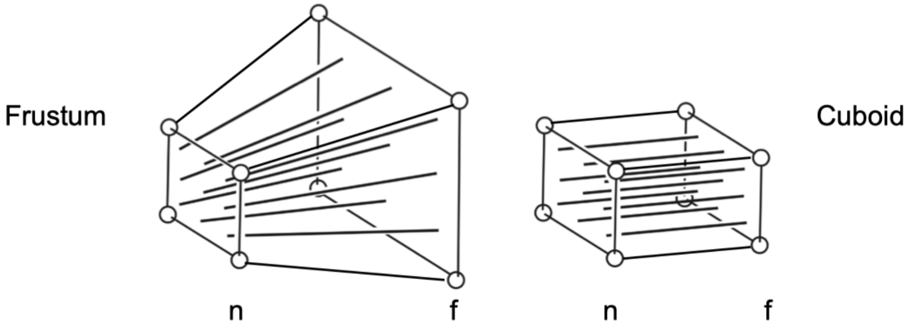

透视投影与正交投影类似，也是经过类似的步骤：

1. 把空间平移到原点
2. 把空间压缩成长方体（近平面不变，压缩远平面）
3. 把空间压缩成 $[-1, 1]^3$ 的立方体（进行一次正交投影）

相比正交投影，透视投影多了一个步骤，就是把视锥体变换成长方体，这个变换暂且叫做 $M_{p \rightarrow o}$ （$p$ 表示透视投影，$o$ 表示正交投影）。

下图是 YZ 平面的截面：

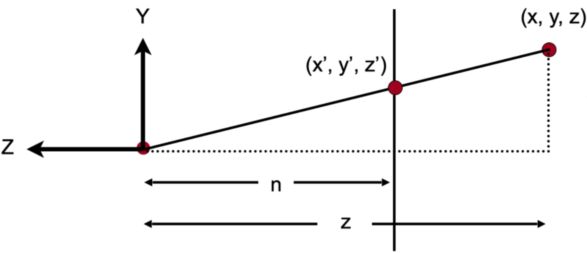

**透视投影矩阵 $M_{persp \to ortho}$ 的推导：**

经过压缩后，对于 y 坐标，空间中的一点 $(x, y, z)$，会变换成 $(x, y', z)$。

根据相似三角形的性质，有：

$$ \frac{n}{z} = \frac{y'}{y} $$

因此：

$$ y' = \frac{n}{z} \cdot y $$

类似地，对于 $x$ 坐标，有：

$$ x' = \frac{n}{z} \cdot x $$

**矩阵形式的表示：**

初步的矩阵乘法形式为：

$$ M_{persp \to ortho} \begin{bmatrix} x \\ y \\ z \\ 1 \end{bmatrix} = \begin{bmatrix} \frac{nx}{z} \\ \frac{ny}{z} \\ \text{unknown} \\ 1 \end{bmatrix} $$

为了在齐次坐标中表示，我们将结果乘以 $z$（这样 $w$ 分量变为 $z$，用于后续的透视除法）：

$$ M_{persp \to ortho} \begin{bmatrix} x \\ y \\ z \\ 1 \end{bmatrix} = \begin{bmatrix} nx \\ ny \\ \text{unknown} \\ z \end{bmatrix} $$


计算 $M_{persp \to ortho}$ 矩阵的第一行，设第一行为 $[a \; b \; c \; d]$，则有：

$$ ax + by + cz + d = nx $$

比较系数可以得到：

- $a = n$
- $b = 0$
- $c = 0$
- $d = 0$

我们可以用同样的方法去计算矩阵的其它行，于是就能得到矩阵的雏形：

$$ M_{persp \to ortho} = \begin{bmatrix} n & 0 & 0 & 0 \\ 0 & n & 0 & 0 \\ ? & ? & ? & ? \\ 0 & 0 & 1 & 0 \end{bmatrix} $$

矩阵的第三行是表示 z 方向的变换的，而我们知道有两个事实：

**事实 1：** 任何在近平面的点，都不会发生变化，即：

$$ \begin{bmatrix} ? & ? & ? & ? \end{bmatrix} \begin{bmatrix} x \\ y \\ n \\ 1 \end{bmatrix} = \begin{bmatrix} x \\ y \\ n \\ 1 \end{bmatrix} = \begin{bmatrix} nx \\ ny \\ n^2 \\ n \end{bmatrix} $$

和刚才一样代入计算（因为刚才乘以过 $z$，所以右边要用 $n^2$，下面的 $f^2$ 同理）：

设第三行为 $[a \; b \; c \; d]$，则有：

$$ ax + by + cn + d = n^2 $$

根据透视投影的特性，第三行的形式为 $[0 \; 0 \; A \; B]$（因为 Z 坐标的变换不依赖于 $x$ 和 $y$），于是得到矩阵第三行的四个元素分别是：$[0 \; 0 \; A \; B]$

因此：

$$ An + B = n^2 $$

**事实 2：** 任何在远平面上的点，$z$ 都不会发生变化。我们取远平面中的一个中心点 $(0, 0, f, 1)$，它在空间压缩前后都不会发生变化，那么：

$$ \begin{bmatrix} 0 & 0 & A & B \end{bmatrix} \begin{bmatrix} 0 \\ 0 \\ f \\ 1 \end{bmatrix} = \begin{bmatrix} 0 \\ 0 \\ f \\ 1 \end{bmatrix} = \begin{bmatrix} 0 \\ 0 \\ f^2 \\ f \end{bmatrix} $$

因此：

$$ Af + B = f^2 $$

**联立方程组：**

$$ \begin{cases} An + B = n^2 \\ Af + B = f^2 \end{cases} $$

**解得：**

从第一个方程减去第二个方程：
$$ An + B - (Af + B) = n^2 - f^2 $$
$$ A(n - f) = n^2 - f^2 = (n - f)(n + f) $$

因此：
$$ A = n + f $$

代入第一个方程：
$$ (n + f)n + B = n^2 $$
$$ n^2 + nf + B = n^2 $$
$$ B = -nf $$

**因此，我们要求的矩阵为：**

$$ M_{persp \to ortho} = \begin{bmatrix} n & 0 & 0 & 0 \\ 0 & n & 0 & 0 \\ 0 & 0 & n+f & -nf \\ 0 & 0 & 1 & 0 \end{bmatrix} $$

**所以，投影矩阵为：**

$$ M_{persp} = M_{ortho} \cdot M_{persp \to ortho} $$

最后的问题就是 $M_{ortho}$ 了。对于这个正交投影，我们只知道 $[f, n]$，还缺少 $[l, r]$ 和 $[b, t]$，但我们可以通过其他途径来计算出这些需要的值。

对于透视投影，还有两个重要的概念，那就是 field of view(fov) 和 aspect ratio。

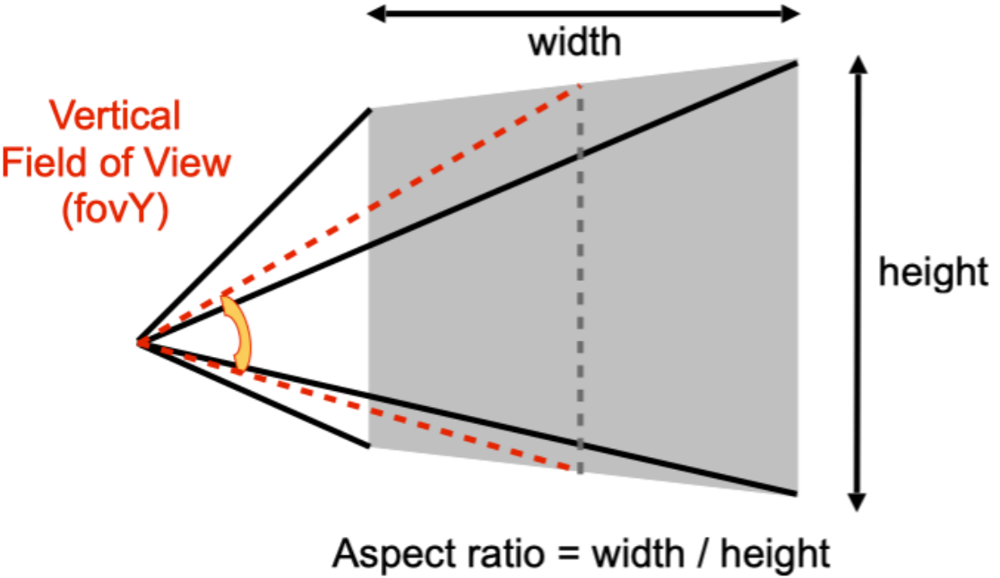

fov 是指视野范围，分为 fovY 和 fovX，两者可以相互推导。

aspect ratio 是指近平面的宽高比。

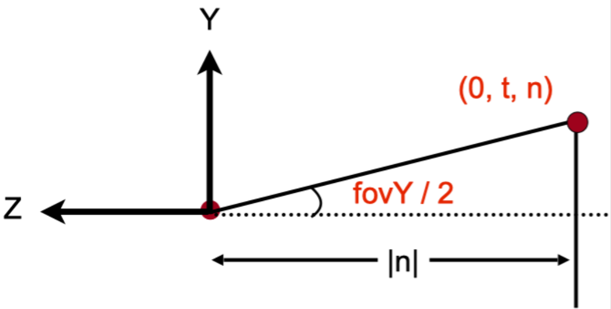

根据三角函数，我们可以知道：

$$ \tan \frac{fovY}{2} = \frac{t}{|n|} $$

另外，根据宽高比的定义，我们可以得出：

$$ \text{aspect} = \frac{\text{width}}{\text{height}} = \frac{2r}{2t} = \frac{r}{t} $$

联立方程可得：

$$ t = |n| \cdot \tan \frac{fovY}{2} $$

$$ r = \text{aspect} \cdot t $$

$$ b = -t $$

$$ l = -r $$

这样，我们就把所需要的值都计算出来了，直接带入上面的正交矩阵公式即可得到完整的透视投影矩阵。


```cpp
// main.cpp
#include <cmath>

constexpr double MY_PI = 3.1415926;
constexpr double DEG_TO_RAD = MY_PI / 180.0;


Eigen::Matrix4f get_model_matrix(float rotation_angle)
{
    Eigen::Matrix4f model = Eigen::Matrix4f::Identity();

    float rad = rotation_angle * DEG_TO_RAD;
    float sin_theta = sin(rad);
    float cos_theta = cos(rad);

    model(0, 0) = cos_theta;
    model(0, 2) = -sin_theta;
    model(2, 0) = sin_theta;
    model(2, 2) = cos_theta;

    return model;
}


Eigen::Matrix4f get_projection_matrix(float eye_fov, float aspect_ratio,
                                      float zNear, float zFar)
{
    Eigen::Matrix4f projection = Eigen::Matrix4f::Identity();
    Eigen::Matrix4f ortho = Eigen::Matrix4f::Identity();
    Eigen::Matrix4f persp_to_ortho = Eigen::Matrix4f::Identity();

    float n = zNear;
    float f = zFar;
    float t = n * tan((eye_fov / 2.0) * DEG_TO_RAD);
    float r = aspect_ratio * t;
    float b = -t;
    float l = -r;

    ortho(0, 0) = 2 / (r - l);
    ortho(1, 1) = 2 / (t - b);
    ortho(2, 2) = 2 / (n - f);
    ortho(0, 3) = -(l + r) / 2;
    ortho(1, 3) = -(b + t) / 2;
    ortho(2, 3) = -(f + n) / 2;

    persp_to_ortho(0, 0) = n;
    persp_to_ortho(1, 1) = n;
    persp_to_ortho(2, 2) = n + f;
    persp_to_ortho(2, 3) = -(n * f);
    persp_to_ortho(3, 2) = 1;
    persp_to_ortho(3, 3) = 0;

    projection = ortho * persp_to_ortho;

    return projection;
}
```