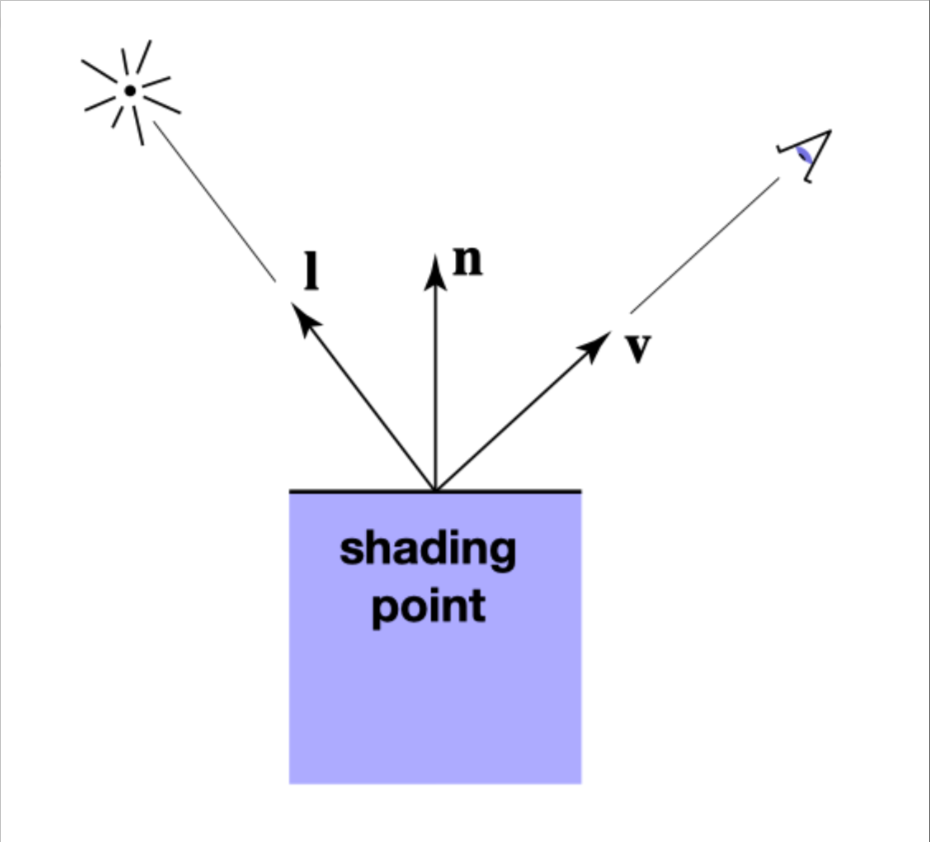
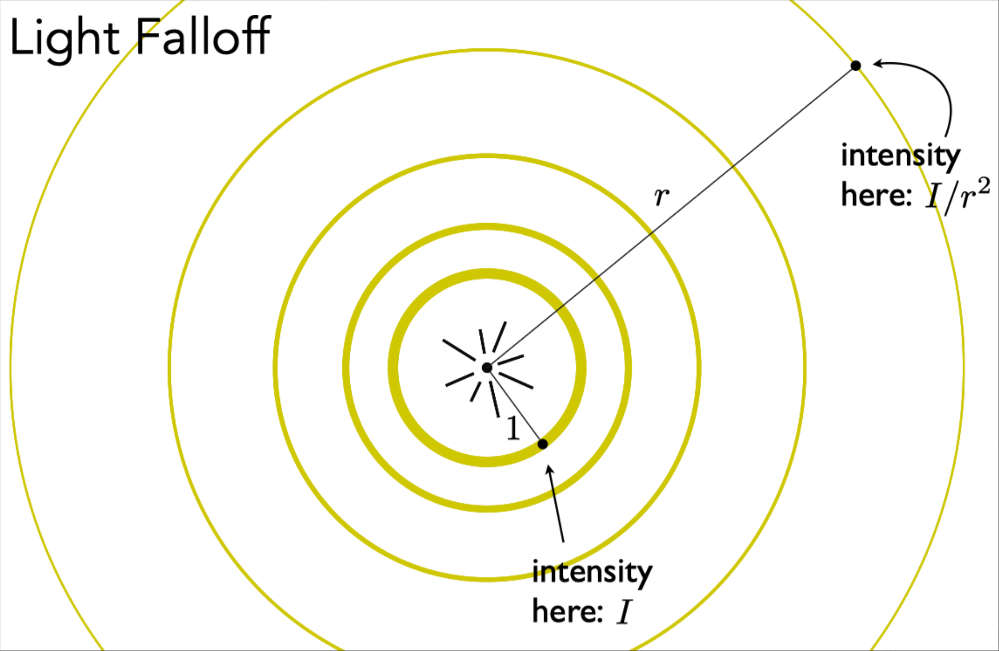
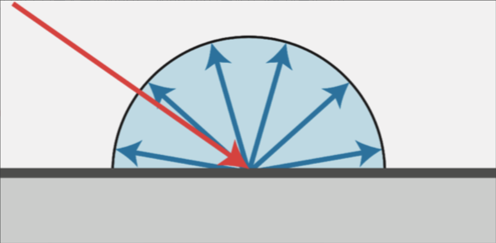
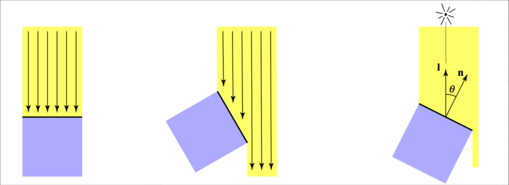
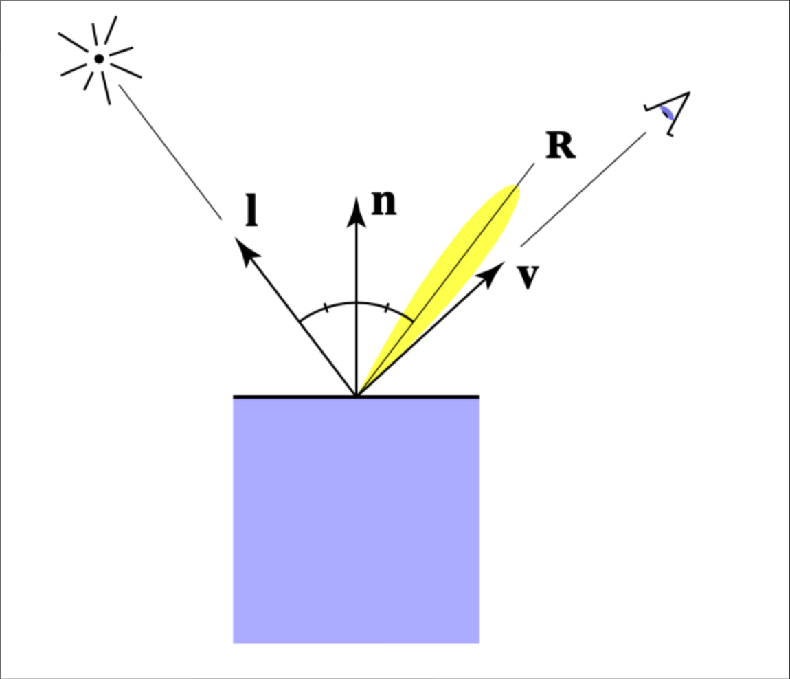
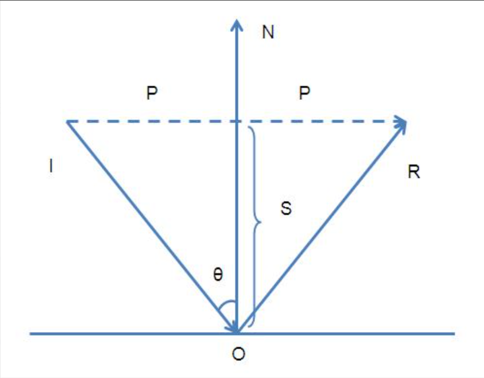
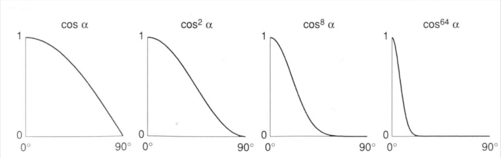
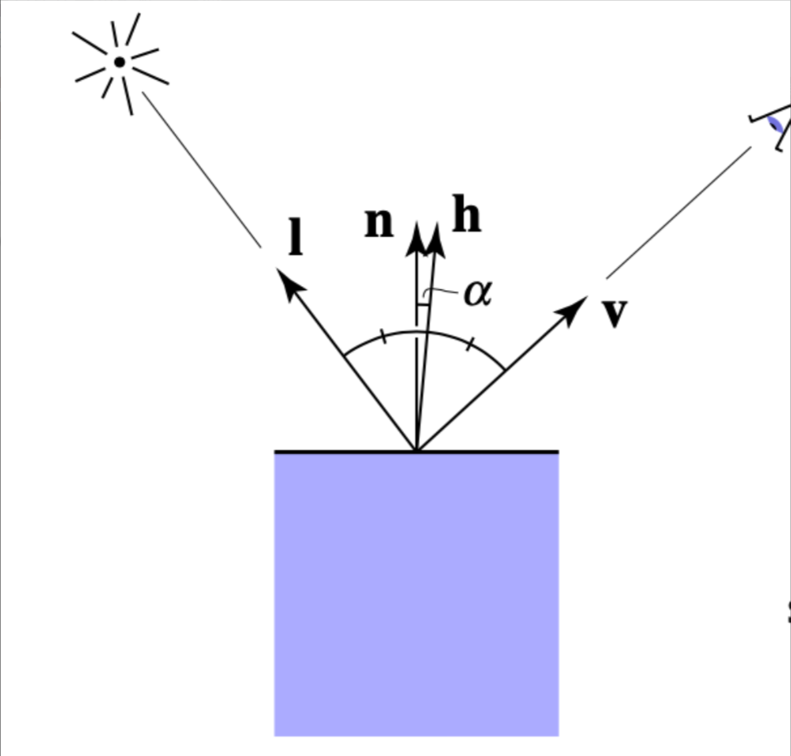

## Blinn-Phong 着色模型

Blinn-Phong 着色模型主要有三部分组成：

- Specular （高光）：由观察角度与光线反射角度共同决定，两者夹角越小，高光越明显
- Diffuse （漫反射）：由物体本身的颜色决定
- Ambient （环境光）：由环境决定

对于每个着色点，我们可以简化成如下图所示：
- $n$ 表示表面法线方向
- $l$ 表示入射光方向
- $v$ 表示观察方向

> 注意：所有向量都是单位向量，所以确保向量进行过 normalize 操作。

## 点光源

假设一个光源为点光源, 传播过程能量守恒，这意味着在半径为 1 时的能量等于半径为 $r$ 时的能量，均为 $E$。

然而，随着半径的增大，球面的表面积也在增大，相当于球面中单位面积的能量减少了。

球面的面积公式: $S = 4\pi r^2$

假设单位面积的能量为 $I_1$，那么半径为 1 时的能量为：$E = I_1 \times 4\pi$

半径为 $r$ 时的能量为：$E = I_r \times 4\pi r^2$

那么, 半径为 $r$ 时的单位面积的能量为：$I_r = \frac{E}{4\pi r^2} = \frac{I_1 \times 4\pi}{4\pi r^2} = \frac{I_1}{r^2}$

## 环境光（Ambient）

对于没有光线直接照射的平面（如最开始的茶杯的背光位置），该平面依旧会受到环境中各种光照的反射，这就是环境光对场景的影响。

我们可以近似地认为场景中的环境光是个常量，它表示来自场景中各个方向的光线的总和，并且不受视角方向的影响，于是有：

$$ L_a = k_a \odot I_a $$

- $L_a$ 表示着色点的环境光分量
- $k_a$ 表示材质的环境光系数，可调节
- $I_a$ 表示场景的环境光强度

> 这里既不是点乘, 也不是叉乘, 而是分量积 (Component-wise Product)

## 漫反射 （Diffuse）

漫反射是指光线照射在物体表面后会往四周反射的现象。

细心的同学会发现，上图中的入射光线和反射光线的颜色是不同的，这是因为当入射光线到达物体表面时，物体表面会吸收一部分能量，然后反射它没有吸收的能量（暂时不考虑折射），也就是物体本身的颜色。

从能量的角度考虑，只有当有能量到达物体表面时，物体才能发生漫反射，那么接下来的问题是，怎么知道有多少能量到达物体表面呢？

观察上图，假设光线是离散的。

左图中的光线与平面法线平行，平面接受了所有光线的能量（6根光线）。

中图中的光线与平面法线夹角为 60度，平面只接受了一半光线的能量（3根光线）。

推广到一般情况下，平面能接受的能量与该平面的法线和入射光的角度有关。其关系是：

$$ \cos \theta = \frac{n \cdot l}{|n| |l|} = n \cdot l $$

那么, 平面能接受的能量为：$E_{diffuse} = I_{in} \times n \cdot l$

漫反射公式为:

到达着色点的能量 $I_r = \frac{I_1}{r^2}$
着色点能接收的能量 $max(0, n \cdot l)$
因此, 漫反射公式为:
$$ L_d = k_d \cdot I_d \cdot max(0, n \cdot l) $$
其中:
- $L_d$ 表示着色点的漫反射分量
- $k_d$ 表示材质的漫反射系数，可调节

## 高光（Specular）

当光线发生反射时，如果当前视角方向与反射方向接近时，我们就能看到高光了。

和漫反射公式类似，我们也需要知道有多少能量到达了平面，有多少能量被反射出去了，不同的地方是我们需要求视角方向与反射方向的夹角。

观察上图，我们能通过向量的几何意义得出：

$\vec{OR} = \vec{IR} + \vec{IO}$
$\vec{OR} = 2\vec{P} - \vec{IO}$
$\vec{P} = \vec{IO} + \vec{S}$

接下来计算 $\vec{S}$, 为 $\vec{OI}$ 在 $\vec{ON}$ 上的投影, 即: $\vec{S} = \frac {\vec{OI} \cdot \vec{ON} } {\|\vec{ON}\|^2} \vec{ON}$

把 $\vec{S}$ 代入上面的式子, 得到:

$\vec{OR} = 2(\vec{IO} + \vec{S}) - \vec{IO} = \vec{IO} + 2\vec{S}$

$\vec{OR} = \vec{IO} + 2\frac {\vec{OI} \cdot \vec{ON} } {\|\vec{ON}\|^2} \vec{ON}$

由于 $\vec{ON}$ 是单位向量, 所以 $\|\vec{ON}\|^2 = 1$, 因此:

$\vec{OR} = \vec{IO} + 2(\vec{OI} \cdot \vec{ON}) \vec{ON}$

$\vec{OR} = \vec{IO} - 2(\vec{IO} \cdot \vec{ON}) \vec{ON} = \vec{IO} - 2\vec{ON}(\vec{IO} \cdot \vec{ON})$

调整一下入射光 $\vec{IO}$ 的方向，使之朝外，并使 $\vec{OR}=\vec{r}$ $\vec{OI}=\vec{l}$ $\vec{ON}=n$ , 得到：

$\vec{r} = 2(\vec{l} \cdot \vec{n}) \vec{n} - \vec{l}$

推出 Specular 公式：

$$ L_s = k_s \cdot \frac{I_s}{r^2} \cdot max(0, (\vec{r} \cdot \vec{v})) $$

由于 Phong 着色模型只是经验模型，并没有考虑太多的物理意义，因此在计算高光的时候并没有像漫反射公式那样考虑有多少能量被吸收了，因此就舍弃了 $max(0, (\vec{l} \cdot \vec{n}))$ 部分。

然而，上面公式计算反射光与视角夹角时会得到一个 0~90 度的范围，这意味着在这个范围中都能看到高光，这显然不符合高光的定义。因此需要对该部分进行修正：

可以看到，如果对 cos 进行指数运算，我们能很容易的调整高光可视范围的阈值，因此可以把该公式修正成：

$$ L_s = k_s \cdot \frac{I_s}{r^2} \cdot max(0, (\vec{r} \cdot \vec{v}))^p $$

 - $L_s$ 表示着色点的高光分量
 - $k_s$ 表示材质的高光系数，可调节
 - $p$ 用来调节高光的可视范围的阈值
 - $max(0, (\vec{r} \cdot \vec{v}))$ 表示反射光与视角夹角的余弦值

 Blinn Phong 着色模型在这基础上进行了优化：当反射向量与视角向量相近时，这相当于视角与入射光的 **半程向量** 与法线的夹角相近：

于是我们可以用半程向量与法线的夹角，可以代替反射向量与视角的夹角，并且半程向量的计算也非常简单：

$$ \vec{h} = \frac{\vec{l} + \vec{v}}{\|\vec{l} + \vec{v}\|} $$

这样就能对刚才的高光公式调整成：

$$ L_s = k_s \cdot \frac{I_s}{r^2} \cdot max(0, (\vec{h} \cdot \vec{n}))^p $$

当我们计算出漫反射、高光、环境光之后，把它们加起来，就能得到 Blinn Phong 着色模型的结果了：

$$ L = L_a + L_d + L_s $$

$$ L = k_a \cdot I_a + k_d \cdot I_d \cdot max(0, n \cdot l) + k_s \cdot \frac{I_s}{r^2} \cdot max(0, (\vec{r} \cdot \vec{v})) $$