## Blinn-Phong 着色模型

Blinn-Phong 着色模型主要有三部分组成：

- Specular （高光）：由观察角度与光线反射角度共同决定，两者夹角越小，高光越明显
- Diffuse （漫反射）：由物体本身的颜色决定
- Ambient （环境光）：由环境决定


对于每个着色点，我们可以简化成如下图所示：
- $n$ 表示表面法线方向
- $l$ 表示入射光方向
- $v$ 表示观察方向

> 注意：所有向量都是单位向量，所以确保向量进行过 normalize 操作。

### 点光源


假设一个光源为点光源, 传播过程能量守恒，这意味着在半径为 1 时的能量等于半径为 $r$ 时的能量，均为 $E$。

然而，随着半径的增大，球面的表面积也在增大，相当于球面中单位面积的能量减少了。

球面的面积公式: $S = 4\pi r^2$

假设单位面积的能量为 $I_1$，那么半径为 1 时的能量为：$E = I_1 \times 4\pi$

半径为 $r$ 时的能量为：$E = I_r \times 4\pi r^2$

那么, 半径为 $r$ 时的单位面积的能量为：$I_r = \frac{E}{4\pi r^2} = \frac{I_1 \times 4\pi}{4\pi r^2} = \frac{I_1}{r^2}$

### 环境光（Ambient）

对于没有光线直接照射的平面（如最开始的茶杯的背光位置），该平面依旧会受到环境中各种光照的反射，这就是环境光对场景的影响。

我们可以近似地认为场景中的环境光是个常量，它表示来自场景中各个方向的光线的总和，并且不受视角方向的影响，于是有：

$$ L_a = k_a \odot I_a $$

- $L_a$ 表示着色点的环境光分量
- $k_a$ 表示材质的环境光系数，可调节
- $I_a$ 表示场景的环境光强度

> 这里既不是点乘, 也不是叉乘, 而是分量积 (Component-wise Product)

### 漫反射 （Diffuse）


漫反射是指光线照射在物体表面后会往四周反射的现象。

细心的同学会发现，上图中的入射光线和反射光线的颜色是不同的，这是因为当入射光线到达物体表面时，物体表面会吸收一部分能量，然后反射它没有吸收的能量（暂时不考虑折射），也就是物体本身的颜色。

从能量的角度考虑，只有当有能量到达物体表面时，物体才能发生漫反射，那么接下来的问题是，怎么知道有多少能量到达物体表面呢？


观察上图，假设光线是离散的。

左图中的光线与平面法线平行，平面接受了所有光线的能量（6根光线）。

中图中的光线与平面法线夹角为 60度，平面只接受了一半光线的能量（3根光线）。

推广到一般情况下，平面能接受的能量与该平面的法线和入射光的角度有关。其关系是：

$$ \cos \theta = \frac{n \cdot l}{|n| |l|} = n \cdot l $$

那么, 平面能接受的能量为：$E_{diffuse} = I_{in} \times n \cdot l$

漫反射公式为:

到达着色点的能量 $I_r = \frac{I_1}{r^2}$
着色点能接收的能量 $max(0, n \cdot l)$
因此, 漫反射公式为:
$$ L_d = k_d \cdot I_d \cdot max(0, n \cdot l) $$
其中:
- $L_d$ 表示着色点的漫反射分量
- $k_d$ 表示材质的漫反射系数，可调节

### 高光（Specular）


当光线发生反射时，如果当前视角方向与反射方向接近时，我们就能看到高光了。

和漫反射公式类似，我们也需要知道有多少能量到达了平面，有多少能量被反射出去了，不同的地方是我们需要求视角方向与反射方向的夹角。


观察上图，我们能通过向量的几何意义得出：

$\vec{OR} = \vec{IR} + \vec{IO}$
$\vec{OR} = 2\vec{P} - \vec{IO}$
$\vec{P} = \vec{IO} + \vec{S}$

接下来计算 $\vec{S}$, 为 $\vec{OI}$ 在 $\vec{ON}$ 上的投影, 即: $\vec{S} = \frac {\vec{OI} \cdot \vec{ON} } {\|\vec{ON}\|^2} \vec{ON}$

把 $\vec{S}$ 代入上面的式子, 得到:

$\vec{OR} = 2(\vec{IO} + \vec{S}) - \vec{IO} = \vec{IO} + 2\vec{S}$

$\vec{OR} = \vec{IO} + 2\frac {\vec{OI} \cdot \vec{ON} } {\|\vec{ON}\|^2} \vec{ON}$

由于 $\vec{ON}$ 是单位向量, 所以 $\|\vec{ON}\|^2 = 1$, 因此:

$\vec{OR} = \vec{IO} + 2(\vec{OI} \cdot \vec{ON}) \vec{ON}$

$\vec{OR} = \vec{IO} - 2(\vec{IO} \cdot \vec{ON}) \vec{ON} = \vec{IO} - 2\vec{ON}(\vec{IO} \cdot \vec{ON})$

调整一下入射光 $\vec{IO}$ 的方向，使之朝外，并使 $\vec{OR}=\vec{r}$ $\vec{OI}=\vec{l}$ $\vec{ON}=n$ , 得到：

$\vec{r} = 2(\vec{l} \cdot \vec{n}) \vec{n} - \vec{l}$

推出 Specular 公式：

$$ L_s = k_s \cdot \frac{I_s}{r^2} \cdot max(0, (\vec{r} \cdot \vec{v})) $$

由于 Phong 着色模型只是经验模型，并没有考虑太多的物理意义，因此在计算高光的时候并没有像漫反射公式那样考虑有多少能量被吸收了，因此就舍弃了 $max(0, (\vec{l} \cdot \vec{n}))$ 部分。

然而，上面公式计算反射光与视角夹角时会得到一个 0~90 度的范围，这意味着在这个范围中都能看到高光，这显然不符合高光的定义。因此需要对该部分进行修正：


可以看到，如果对 cos 进行指数运算，我们能很容易的调整高光可视范围的阈值，因此可以把该公式修正成：

$$ L_s = k_s \cdot \frac{I_s}{r^2} \cdot max(0, (\vec{r} \cdot \vec{v}))^p $$

 - $L_s$ 表示着色点的高光分量
 - $k_s$ 表示材质的高光系数，可调节
 - $p$ 用来调节高光的可视范围的阈值
 - $max(0, (\vec{r} \cdot \vec{v}))$ 表示反射光与视角夹角的余弦值

 Blinn Phong 着色模型在这基础上进行了优化：当反射向量与视角向量相近时，这相当于视角与入射光的 **半程向量** 与法线的夹角相近：


于是我们可以用半程向量与法线的夹角，可以代替反射向量与视角的夹角，并且半程向量的计算也非常简单：

$$ \vec{h} = \frac{\vec{l} + \vec{v}}{\|\vec{l} + \vec{v}\|} $$

这样就能对刚才的高光公式调整成：

$$ L_s = k_s \cdot \frac{I_s}{r^2} \cdot max(0, (\vec{h} \cdot \vec{n}))^p $$

当我们计算出漫反射、高光、环境光之后，把它们加起来，就能得到 Blinn Phong 着色模型的结果了：

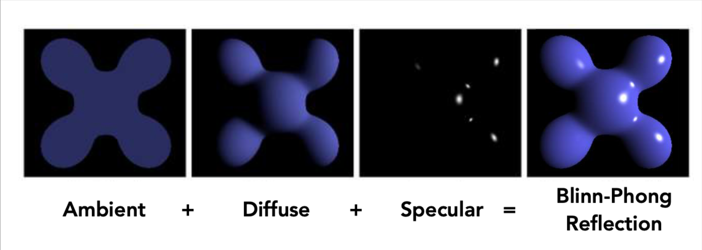

$$ L = L_a + L_d + L_s $$

$$ L = k_a \cdot I_a + k_d \cdot I_d \cdot max(0, n \cdot l) + k_s \cdot \frac{I_s}{r^2} \cdot max(0, (\vec{r} \cdot \vec{v})) $$

## 着色频率

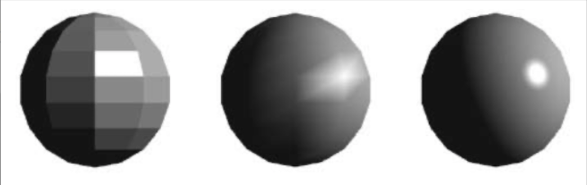

着色频率指的是发生着色的频率，如上图所示，上面三个球都拥有相同的几何形状，但应用了不同的着色频率，分别是：平面着色（左）、高洛德着色（中）、冯氏着色（右）。

平面着色（Flat）
平面着色是指整个三角面中共用一个方向的法线，因此表现为整个三角面的颜色都是一样的。

高洛德着色（Gouraud）
高洛德着色是指三角面中三个顶点分别拥有自己的法线，然后在着色时先计算出这三个顶点的颜色，然后其他像素就以插值的方式去计算出其对应的颜色。

冯氏着色（Phong）
冯氏着色是指三角面的三个顶点分别拥有自己的法线，然后其他像素也通过插值的方式计算出其对应的法线，然后每个像素都能进行着色。

如图所示，着色频率对结果的影响，取决于模型的复杂度。模型的复杂度越低，着色结果区别越大，但随着模型复杂度的提高，平面着色也可以达到冯氏着色的效果。因此我们不能迷信冯氏着色一定比平面着色好。

## 纹理映射（Texture Mapping）

根据着色公示，我们能计算出每个像素的颜色。但如果我们想要模型显示出更加复杂的颜色呢？例如把一张图片贴到物体表面，如上图中的球和地面那样，它们并不是简单的光照颜色，而是复杂的颜色，这种复杂的颜色看起来是来自于某张纹理的。

回顾漫反射公式中，我们可以通过改变 $k_d$ 来调整漫反射分量，当这个 $k_d$ 包含了纹理中某个区域的颜色时，这其实就相当于把该纹理应用到着色公式中了。

事实上，我们的确是通过某种方式找到物体表面与纹理的关系的，物体表面的某一个三角面对应了纹理中的个区域：

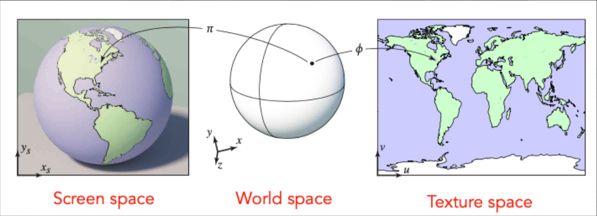

如上图所示，在屏幕空间中的任意一点，我们都能找到它在贴图空间中对应的位置，这个对应关系就是 纹理映射。

由于任意一个三维物体它都是由二维的三角面构成的，因此我们可以利用这个性质，来建立空间中的三角形与二维纹理中的映射关系。 这项工作通常是在建模软件中完成的。

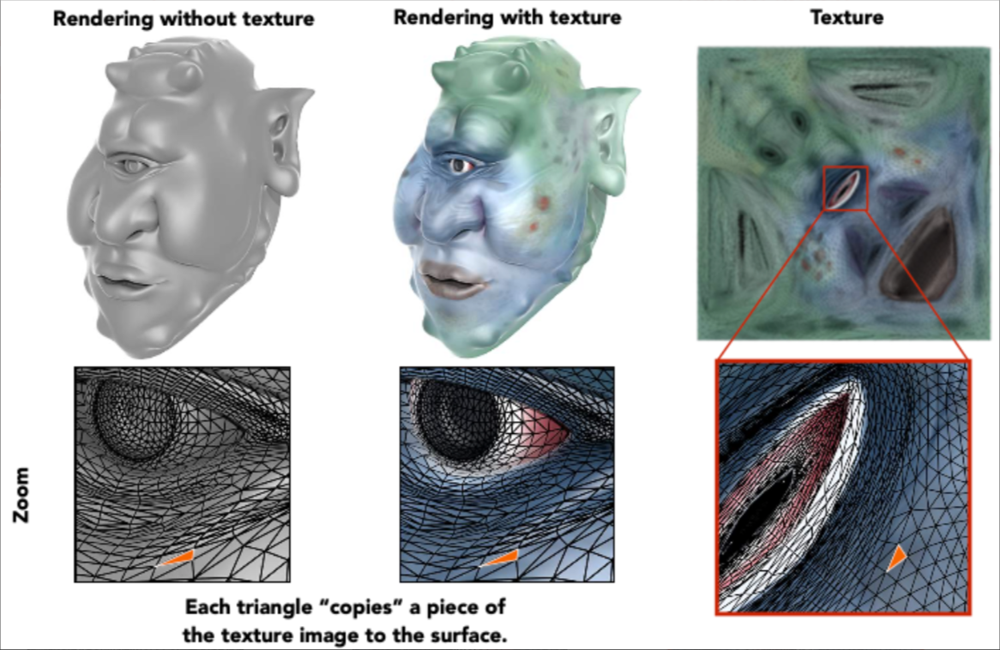

接下来的问题是，如何表示这个对应关系呢？答案是 UV坐标。

UV 坐标是指以纹理左下角为原点来建立的二维坐标系，横坐标为 U，纵坐标为 V，它们的取值范围都是 $[0, 1]$
，这个取值范围与贴图尺寸无关，即纹理最大宽高在 UV 中都是表示为 1。

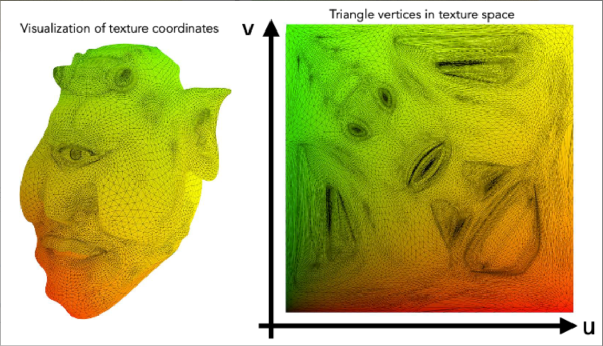

只要三角形中的每个顶点都保存了一个 UV 坐标的信息，那么在着色的时候就可以通过 UV 坐标找到该纹理对应的区域，这样就可以实现应用纹理的效果了。

现在，我们知道了三角形的三个顶点中都包含了 UV 坐标，但三角形中的任意一点的 UV 坐标又应该怎么计算呢？这时候就需要引入一个新的概念：重心坐标。

## 重心坐标（Barycentric Coordinates）

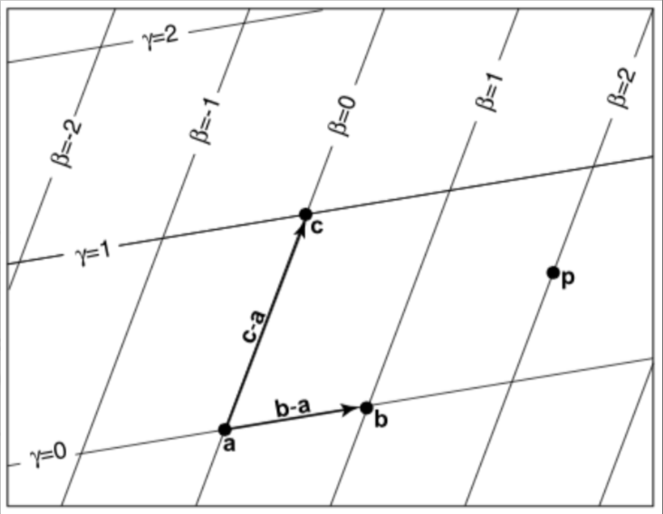

重心坐标是以三角形的其中一个顶点为原点，分别以另外两个顶点作为基向量作为一个新的坐标系，如上图所示就是以 $a$ 为原点，以 $\vec{ab}$ 和 $\vec{ac}$ 作为基的坐标系。

在这个坐标系中，任意一个点 $p$ 可以表示成：

$$ p = a + \beta (b-a) + \gamma (c-a) $$

移项得：

$$ p = (1-\beta-\gamma)a + \beta b + \gamma c $$

令 $\alpha = 1-\beta-\gamma$，于是我们就能得到 p 点的表示方式：

$$ p = \alpha a + \beta b + \gamma c $$

其中，$\alpha$、$\beta$、$\gamma$ 就是 p 点的重心坐标，它们的取值范围都是 $[0, 1]$，并且满足 $\alpha + \beta + \gamma = 1$。

当 $\alpha$、$\beta$、$\gamma$ 同时为非负数的时候，$p$ 点会位于三角形内部。

重心坐标还有另一种表示方式，即每一个分量等于该顶点所对应的面积与整个三角形面积的比值：

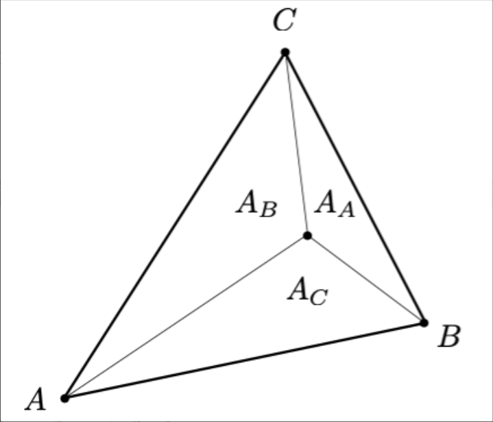

如图所示，A 所对应的面积为 $S_A$，B 所对应的面积为 $S_B$，C 所对应的面积为 $S_C$，于是重心坐标的三个分量就是：

$$ \alpha = \frac{S_A}{S_A + S_B + S_C} $$

$$ \beta = \frac{S_B}{S_A + S_B + S_C} $$

$$ \gamma = \frac{S_C}{S_A + S_B + S_C} $$

根据重心坐标的定义，我们能得到几个很特殊的重心坐标：

- 顶点 A 的坐标：$(1, 0, 0)$
- 顶点 B 的坐标：$(0, 1, 0)$
- 顶点 C 的坐标：$(0, 0, 1)$

- 三角形的重心：$(1/3, 1/3, 1/3)$

最后，我们可以把二维平面中的三角形的任意一点 $(x, y)$ 转化成重心坐标 $(\alpha, \beta, \gamma)$，这里有一个通用公式：

$$ \alpha = \frac {-(x - x_B)(y_C - y_B) + (y - y_B)(x_C - x_B)} {-(x_A - x_B)(y_C - y_B) + (y_A - y_B)(x_C - x_B)} $$

$$ \beta = \frac {-(x - x_C)(y_A - y_C) + (y - y_C)(x_A - x_C)} {-(x_B - x_C)(y_A - y_C) + (y_B - y_C)(x_A - x_C)} $$

$$ \gamma = 1 - \alpha - \beta $$

有了重心坐标之后，我们就能计算出三角形中任意一点的属性了：

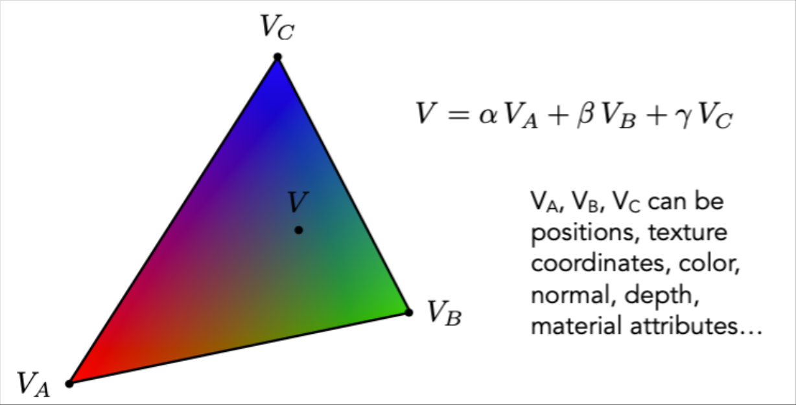

无论是位置、法线、颜色、UV 等等其他的属性，我们都能通过重心坐标计算出三角形中任意一点的属性。

> 需要注意的是，由于三角形在投影前后的重心坐标（形状）会发生变化，因此并不能用投影后的三角形的重心坐标来计算，必须把它还原成投影前的三角形，然后计算其重心坐标，再计算对应的属性。

## 插值矫正

为什么需要进行插值矫正? 在屏幕空间，对三角形内部一点，用重心坐标插值一个属性（如 z / u / v / color），这个公式叫做仿射插值（Affine interpolation）：

$$ A = \alpha A_0 + \beta A_1 + \gamma A_2 $$`

这是仿射插值（Affine interpolation）
> 仿射插值与线性插值的区别
仿射是平移 + 变换, 仿射插值在仿射变换下不变

透视投影的矩阵中,有一项是  x/z 和 y/z, 除以 z 是非线性的

所以：3D 空间里“线性变化”的量, 投影到屏幕后不再线性.

举个极简直觉例子: 
一条 3D 直线, 离相机近的一端: z 小, 离相机远的一端: z 大, 投影到屏幕后: 近的部分被“拉伸”, 远的部分被“压缩”, 所以你在屏幕上“走了一半”, 在 3D 空间里根本不是走了一半.

透视插值真正要保证的是什么？
属性 A 在 3D 空间中是线性变化的

- 深度 z
- 纹理坐标 u, v
- 世界坐标
- 法线插值前的基向量

$$
a_{corrent} =
\frac{
\alpha \frac{a_0}{w_0}
+
\beta \frac{a_1}{w_1}
+
\gamma \frac{a_2}{w_2}
}{
\alpha \frac{1}{w_0}
+
\beta \frac{1}{w_1}
+
\gamma \frac{1}{w_2}
}
$$

## 应用纹理

有了重心坐标之后，我们能计算出任意一个像素对应 UV 坐标了，然后就能为每个像素应用纹理了。应用纹理的逻辑非常简单，只要遍历就可以了：

```cpp
for each pixel(x, y):
    uv = getUv(x, y)
    texColor = sample2D(texture, uv)
    kd = texColor 
```

然而在应用纹理的时候，我们会遇到一些问题，这些问题的都与纹素有关。

### 纹素（Texel）

纹素与像素非常相似，像素是组成屏幕的基本单位，而纹素则是组成纹理的基本单位，它和像素一样都是有面积的。

每个像素的尺寸为  $\frac 1 {屏幕宽度} \times \frac 1 {屏幕高度}$ 

每个纹素的尺寸为  $\frac 1 {纹理宽度} \times \frac 1 {纹理高度}$ 

显然，根据重心坐标计算出来的 UV 坐标是一个浮点数，它会落在纹理中的任意位置。当我们尝试在该位置采样的时候，就会遇到一个问题：我们应该取什么颜色？

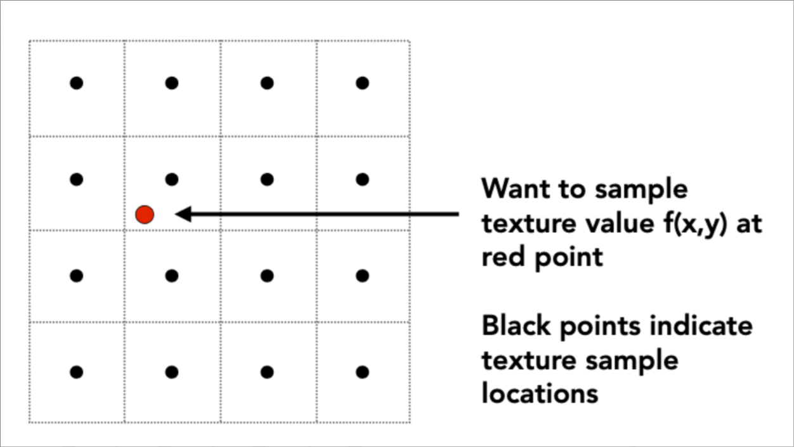

如图所示，虚线框表示纹素，黑色点表示纹素的中心，红色点表示要采样的位置。显然，我们需要一个采样策略去决定应该获得什么颜色，常见的策略有：

- Nearest 取该采样点所在的纹素的颜色（会发生一次采样）

- Linear 取该采样点周围四个纹素的颜色，然后进行加权平均（会发生四次采样）

还有一个问题，当纹理尺寸与显示区域尺寸不同的时候，应该怎么办呢？

假设我们的显示区域的尺寸是 4x4，当我们要把一张 2x2 的纹理铺满整个显示区域时，我们就需要对它进行放大。当我们要把一张 8x8 的纹理铺满整个显示区域时，我们就需要对它进行缩小。这时候就涉及到纹理放大和纹理缩小。

### 纹理放大（Texture Magnification）

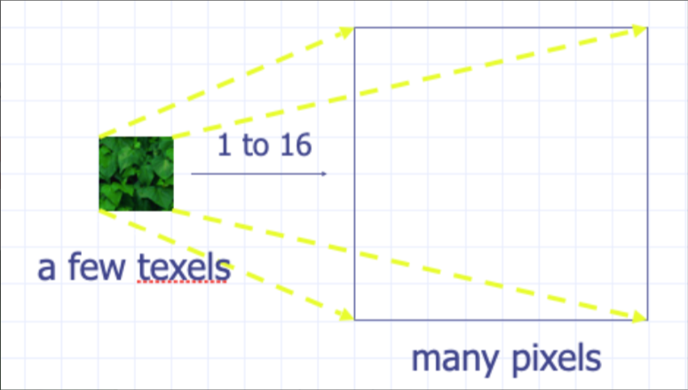

### 纹理缩小（Texture Minification）

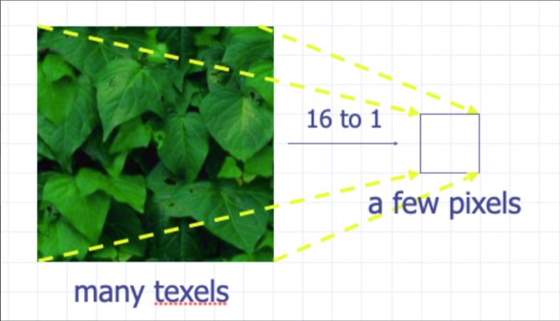

### 走样问题

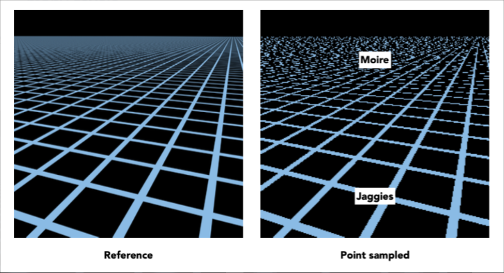

当我们尝试渲染在一个面片上面贴一张网格图的时候，我们期望得到左边的结果，但实际上得到的是右边的结果，近距离出现锯齿，远距离出现摩尔纹。

这是因为每个像素对应的纹素区域不同导致的。

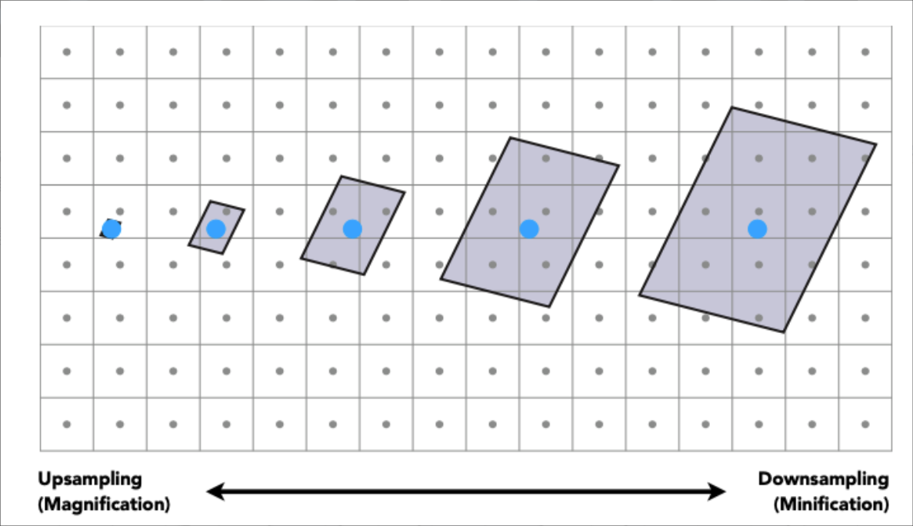

对于近距离的像素来说，它所覆盖的纹素范围较少，纹理发生了放大。

对于远距离的像素来说，它所覆盖的纹理范围较大，纹理发生了缩小。

这背后的问题就是，对于每个像素来说，它们表示的要表示的区域各不相同，但最终要以一个颜色来填充整个像素。

这是一个典型的走样问题，我们可以通过之前学到的超采样来实现反走样，下面是 512 倍超采样的结果：

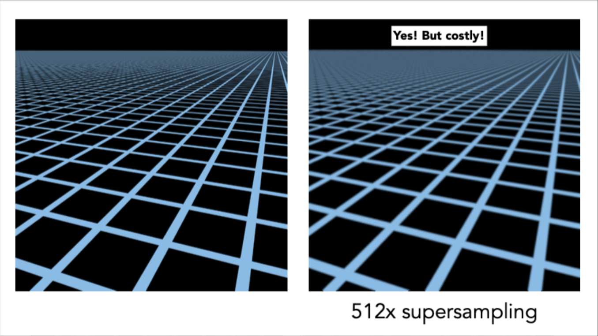

可以看到，超采样的效果比较明显，但它有一个致命的问题：性能消耗巨大。而且对于远距离的像素来说，超采样明显是浪费的，有没有一种更好的方案去解决这种由纹理采样带来的问题呢？

细心想想，我们刚刚对纹理采样是一种点查询，也就是通过一个 UV 坐标去获取一个纹素的颜色的，如果有一种方式可以实现范围查询，也就是通过一个 UV 坐标去获取一个范围（任意大小）的平均颜色，那么就能完美解决这个问题了。

而这个方案就是Mipmap。

### Mipmap

Mipmap 是指根据一张纹理去生成一系列更小的纹理的技术。

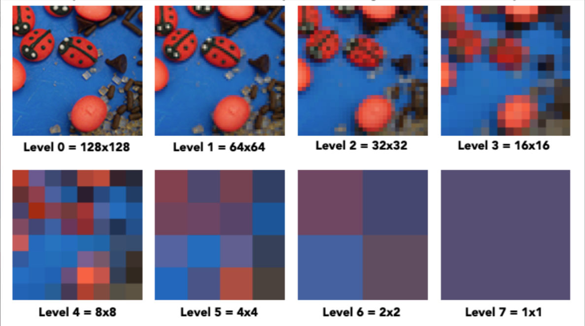

如图所示：

第 0 级是纹理的原尺寸
第 1 级由第 0 级纹理缩放 1/2 所得
…
第 n 级由第 n - 1 级纹理缩放 1/2 所得
最后一级的纹理尺寸为 1x1

每一级 mipmap 中的每一个像素，都是由上一级 mipmap 相邻的四个像素求平均所得。

最后，我们就能得到这个金字塔形状的贴图链：

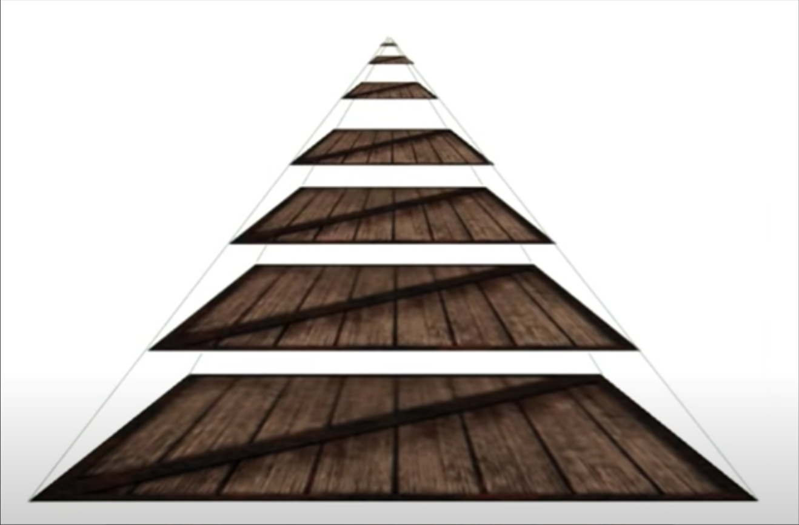

**这个 mipmap 有什么用呢？**

在采样的时候，我们可以先计算出这个像素覆盖了多大范围的纹素，然后再计算出这个范围应该对应到第几层 mipmap，再对该层 mipmap 进行采样，这样就相当于得到了原区域纹素的平均颜色了。 例如：

当一个像素覆盖了 1 个纹素的时候，采样时应该访问第 0 层 mipmap
当一个像素覆盖了 2 个纹素的时候，采样时应该访问第 1 层 mipmap
当一个像素覆盖了 4 个纹素的时候，采样时应该访问第 2 层 mipmap
…
当一个像素覆盖了 128 个纹素的时候，采样时应该访问第 7 层 mipmap
那要怎么计算一个像素覆盖了多少纹素呢？其实有很多方法可以计算的，这里只介绍一个简单的做法：

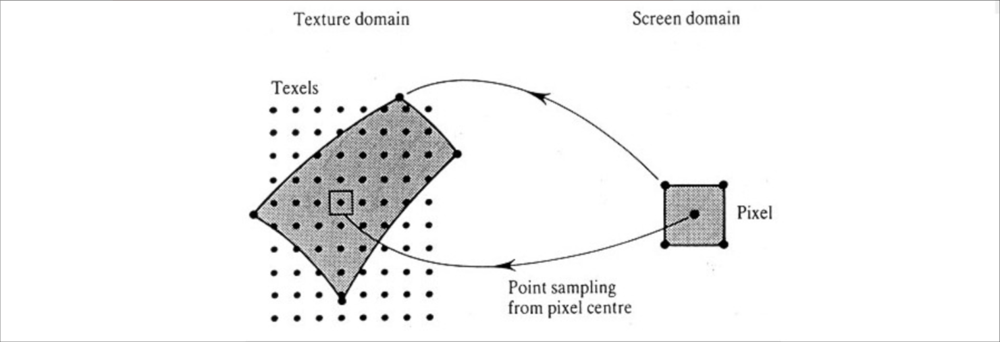

要根据该像素的四个角的 UV 坐标，计算出它们映射到纹理上的位置，然后把它们连起来就可以了。 实际上，我们在采样 mipmap 的时候，会把这个查询区域近似看成正方形，而这个过程中有更复杂的算法去实现，具体可以查阅相关资料。

假设一个像素覆盖了 N 个纹素，应该采样的层数为 L，那么它们的关系就是：$ L = log_2(N) $

显然，L 有可能是一个浮点数，如 1.5，这时候应该怎么办呢？很简单，先采样第1 层，然后采样第 2 层，再对两个值进行插值即可。

需要注意的是，由于 mipmap 通过原尺寸的纹理生成了一系列更小的纹理，这样会导致存储体积增大，增大了多少呢？显然，这是一个等比数列求和问题， 于是我们可以套用一下公式：

$$S_n = a_1 \frac {1 - q^n} {1 - q}$$

由于它的公比是 1/4（因为宽高都为上一级的一半），而首项可以看作是 1，于是代入公式可得：

$$S_n = 1 \frac {1 - (1/4)^n} {1 - 1/4} = 4/3 (1 - (1/4)^n)$$

当 n 趋近于无穷大时，$ (1/4)^n $ 趋近于 0，于是我们可以得到：

$$S_n = 4/3$$

因此，使用 mipmap 之后，存储体积会比原来增大 1/3 倍。

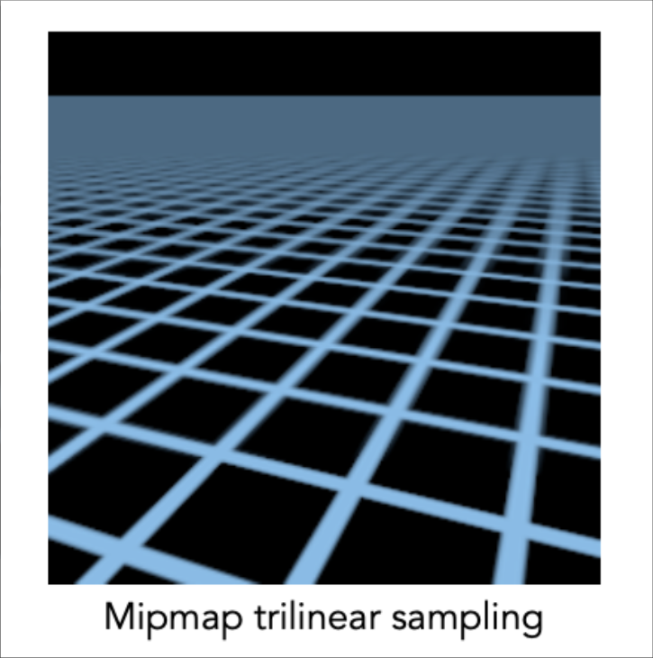

### 各向异性过滤（Anisotropic Filtering）

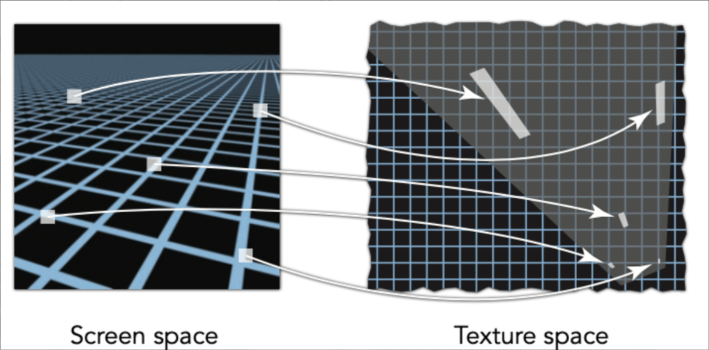

这是因为对于远处的像素来说，它们覆盖的纹素实际上并不是一个正方形，而是一个扁矩形，采样 mipmap 的时候以正方形区域来采样会带来比较大的误差。

因此这里需要一种新的策略，这就是各向异性过滤的作用了。

和 mipmap 类似，各向异性过滤也是利用原纹理去生成更小尺寸的纹理的技术，mipmap 生成的是宽高比例不变的纹理，而各向异性过滤生成的是宽高比例会发生变化的纹理。如下图所示：

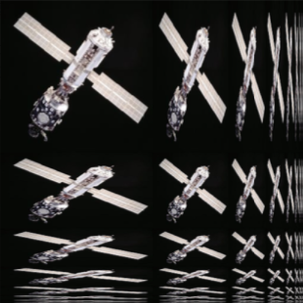

左上角的是原纹理，顺着左上角往右下角方向生成的是 mipmap，它们与原纹理是等比例的，此外的其他纹理都是由各向异性过滤而生成的纹理。

和 mipmap 一样，各向异性过滤和也是有层级的，对于上面的那张图，层级如下图所示，相同颜色的区域表示相同层级下的各向异性过滤：

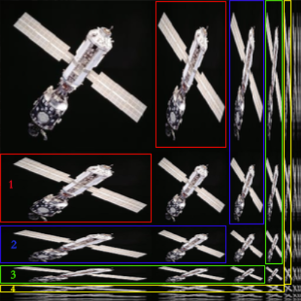

我们可以在各种图形 API 中去控制应该生成哪些层级的各向异性过滤的纹理。

有了各向异性过滤之后，在对于扁矩形区域，我们就可以找到对应的纹理中查询颜色了。我们来看看使用了各向异性过滤之后的效果：

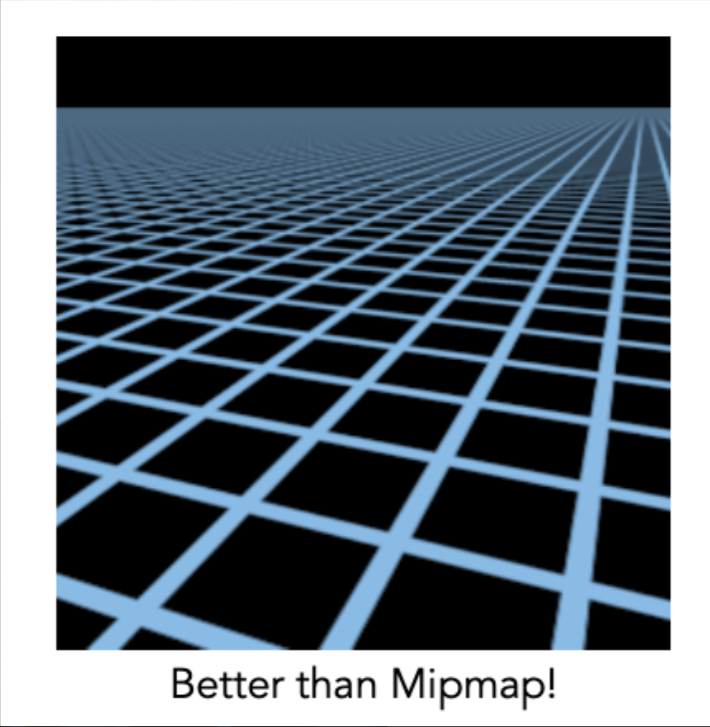

可以看到，使用了各向异性过滤之后，远处的摩尔纹问题得到了解决。

### 各式各样的纹理

上面的例子中，我们通过使用纹理去改变了着色公式中的$K_d$项，显然，着色公式中的其他项也可以利用纹理去改变的。

正是这个原因，我们会看到各种各样的纹理，如表示环境光的 sphereMap 和 cubeMap，表示法线的 normalMap 等等。下面介绍几种常见的纹理。

#### 球面贴图（Spherical Map）

环境贴图可以用来表示环境光照。由于环境光是来自四面八方的，因此在采样环境光的时候可以把其看成是一个球面。

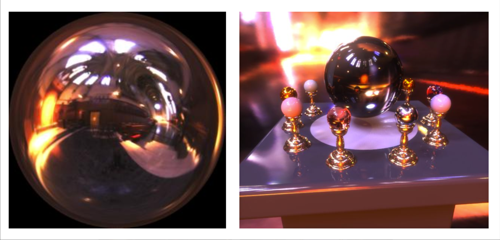

上图中左图是把环境贴图应用在球面上，然后右图的场景中则是利用该环境贴图进行采样得到的结果。

但球面贴图有一个缺点，就是容易发生变形，特别是靠近北极南极的区域，变形非常严重。

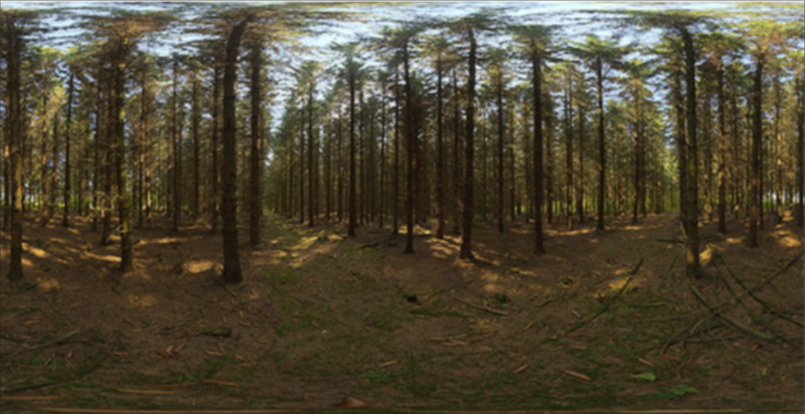

这种现象就导致了如果用球面贴图提供光照信息，那么北极南极方向的光照信息会变得不准确。

#### 立方体贴图（Cube Map）

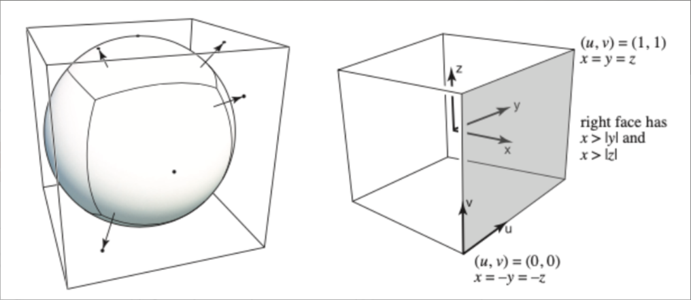
!
立方体贴图是另一种环境贴图，它是利用六张图来构建成一个立方体，然后再根据法线方向去判断采样哪一个面。

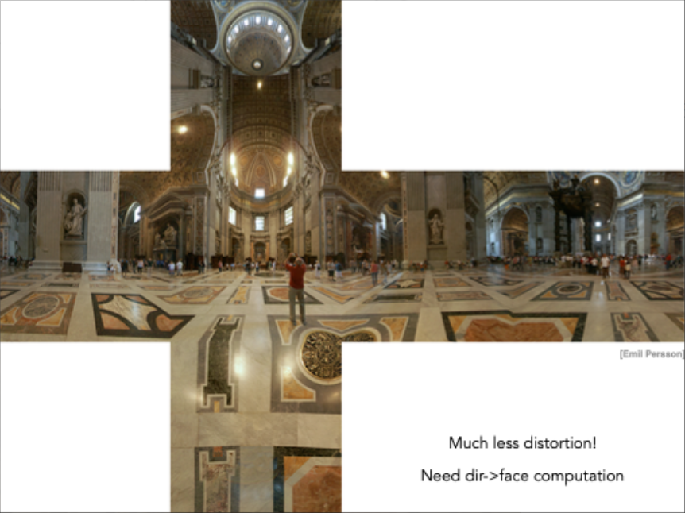

这种方案比球面贴图更少变形，但需要把一张环境贴图去成六张尺寸相同的图。

#### 凹凸贴图（Bump Map）

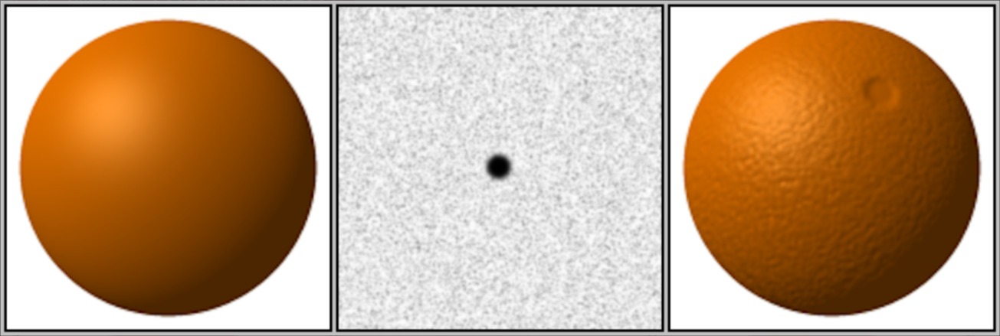

凹凸贴图是一种为模型添加细节的贴图。凹凸贴图是一张灰度图，它保存了着色点与原始表面的高度差，以此来影响光照信息。

#### 法线贴图（Normal Map）

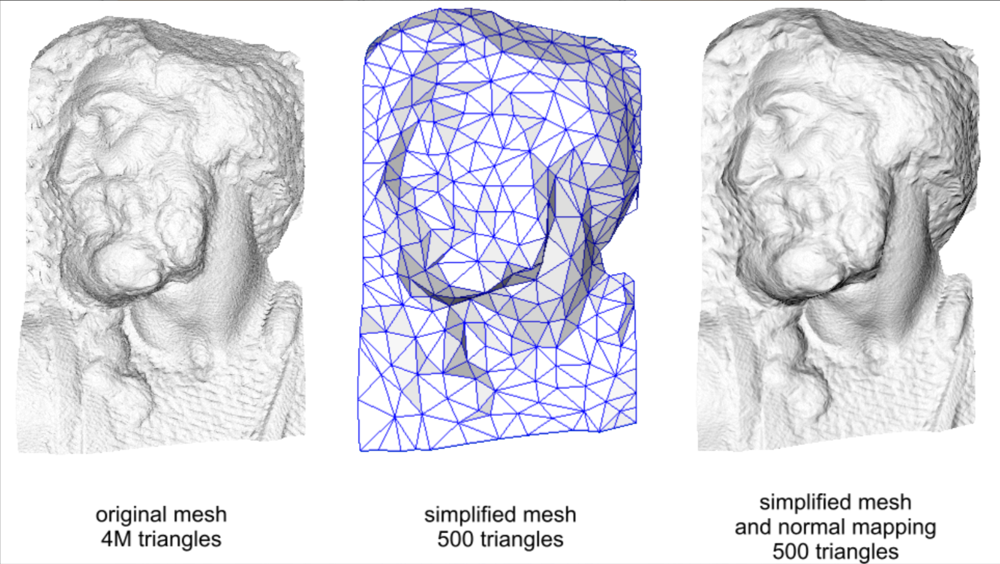

法线贴图是凹凸贴图的另一种实现，原理是改变着色点的法线方向，从而影响光照结果。

从上面可以看到，我们可以用低模加法线贴图，来模拟高模的效果。