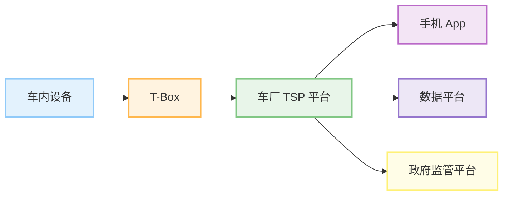
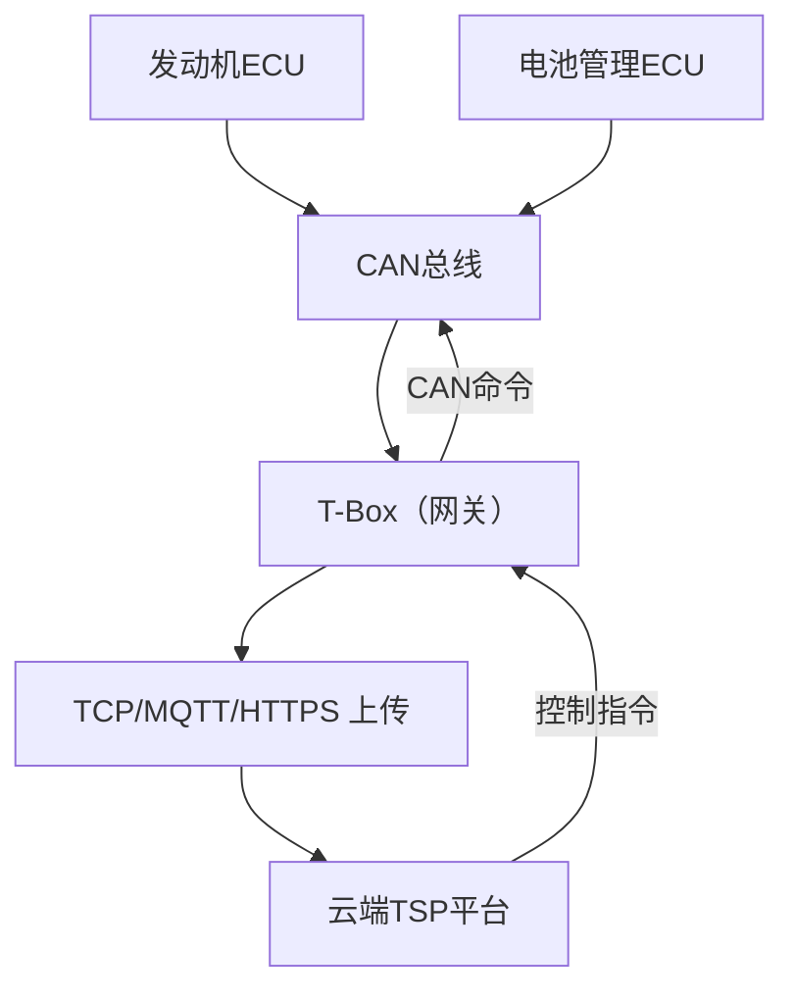

| 项目   | T-Box （Telematics Box）   | TSP （Telematics Service Platform） |
| ---- | ------------------------ | --------------------------------- |
| 位置   | 车载硬件，安装在车辆内部             | 云端系统，部署在车厂/服务商的服务器                |
| 本质   | 车载通信控制器，类似“调制解调器”或“网关”   | 后台服务平台，处理数据、提供接口、做业务逻辑            |
| 作用   | 采集车辆数据、发送消息、执行远程指令       | 管理车辆数据、用户数据、发送指令、与外部对接            |
| 功能举例 | 定位上传、故障上报、接收OTA、远程控制车门   | 用户登录、车辆绑定、轨迹展示、OTA策略下发            |
| 协议   | 支持私有/标准协议（如 GB/T 32960）  | 接收TBox协议并解析、也会暴露HTTP/MQTT等接口      |
| 开发重点 | 嵌入式开发、CAN通信、无线通信（LTE/5G） | 后端开发、数据处理、接口安全、指令队列管理             |

**专业术语：**
EE架构，汽车电子电气架构
ECU	Electronic Control Unit，电子控制器单元
T-BOX	telematics box，远程通信模块
CAN	Controller Area Network，控制器区域网络，总线协议之一
LIN	总线协议之一，串行通讯网络
FlexRay	总线协议之一，一种时间触发式的总线系统
ADAS	Advanced Driver Assistance Systems，高级驾驶辅助系统
BCM	汽车车身控制模块
VCU	整车控制器
ACU	自动驾驶域控制器
HeadUnit：车载娱乐信息系统，简称HU或HUT
TSP	Telematics Service Provider，汽车远程服务提供商，车联网服务平台
TBOX：Telematics Box，简称TBOX（T盒），TBOX主要用于采集车辆数据与TSP平台实时通信，数据上报，人车交互。
SMS：短信平台。
GBCENTER：国标平台或地标平台的简称。

I-Call：提供资讯，一键导航等。
B-Call：提供道路救援服务。
E-Call：提供紧急救援服务。
VIN：车辆识别码，简称车架号。
IMSI：SIM卡服务识别号，用来识别SIM卡入网服务的标识。
ICCID：SIM卡硬件识别号，用来识别SIM卡的硬件。
IMEI：TBOX的唯一设备识别码，用于区分TBOX设备。

![[assets/Pasted image 20250508220704.png]]![[assets/Pasted image 20250508220857.png]]

https://www.iotsec-zone.com/article/367

| 协议      | 是否常用      | 使用场景                 | 优点                 | 缺点                 |
| ------- | --------- | -------------------- | ------------------ | ------------------ |
| ✅ MQTT  | ⭐⭐⭐⭐（最常用） | 实时通信、状态上报、远程指令       | 轻量、支持长连接、低功耗、QoS保障 | 二进制协议调试不便，需专用客户端工具 |
| ✅ TCP   | ⭐⭐        | 自定义协议的基础（尤其是早期TSP系统） | 灵活、可定制、性能好         | 无标准结构，需自行设计会话管理等   |
| ✅ HTTPS | ⭐⭐        | 设备注册、补发数据、升级等非实时操作   | 安全（TLS），调试方便，浏览器兼容 | 建连慢、通信频繁时效率低、功耗高   |

|场景|推荐协议|理由|
|---|---|---|
|实时状态上报 / 指令推送|MQTT|长连接低延迟，支持 QoS，广泛适用于车联网|
|大文件传输（如 OTA 升级）|HTTPS|传输可靠、易部署 CDN，支持断点续传|
|首次注册 / 鉴权 / 配置拉取|HTTPS|安全且只需偶尔连接|
|定制老平台或无 MQTT 网关的系统|TCP|允许厂商完全定制协议格式，但需额外开发解析逻辑|

| 项目   | CAN 总线                            | TCP 协议                                |
| ---- | --------------------------------- | ------------------------------------- |
| 定义   | 控制器局域网协议（Controller Area Network） | 传输控制协议（Transmission Control Protocol） |
| 工作层级 | **物理层 + 数据链路层**                   | **传输层**（TCP/IP 四层模型）                  |
| 应用场景 | 汽车内、工业自动化、机器人                     | 互联网通信（浏览器、APP、Web服务器）                 |
| 传输方式 | 广播式（所有节点接收），无连接                   | 面向连接，一对一可靠通信                          |
| 带宽   | 通常 ≤ 1 Mbps（CAN FD 可提升）           | 取决于网络环境（10Mbps ~ Gbps）                |
| 典型通信 | 车内 ECU 之间传感器/控制器数据传输              | 网页加载、聊天消息、视频流传输等                      |

## 🚗 CAN → 网关 → TCP/MQTT → TSP 通信链路总览图

less

复制编辑

`[ 各类ECU ]    |    ↓（CAN总线） [ 车载网关（T-Box） ]    |    ↓（TCP/MQTT/HTTPS） [ TSP云平台 ]`

---

## 🔍 一、角色说明

|角色|说明|
|---|---|
|**ECU**|发动机/车身/空调等控制器，工作在 CAN 网络中|
|**T-Box/网关**|连接 CAN 总线，收集数据并上传到云（TSP）|
|**TSP**|云端平台，接收数据、做远程控制、OTA、监控等|

---

## 🔄 二、详细流程

### 🚘 1. 车内 CAN 网络采集数据

- 每个 ECU 周期性广播自己的状态，如：
    
    - 发动机 ECU → 发转速数据；
        
    - 电池管理 ECU → 发电压/温度数据；
        
- 这些数据都是 **CAN 报文（ID + Data）**。
    

### 📦 2. T-Box 作为**CAN 网关**

- T-Box 连接到 CAN 总线；
    
- 使用驱动程序（如 SocketCAN 或专用 MCU 驱动）监听所有 CAN 报文；
    
- 通过 DBC 文件（协议定义）解析报文成**可读参数**；
    
    makefile
    
    复制编辑
    
    `0x100: vehicle_speed = 80 km/h 0x205: battery_voltage = 12.4 V`
    

### 🧠 3. T-Box 做协议适配和打包

- 将解析后的数据转换成**云平台能识别的格式**：
    
    - 自定义 JSON；
        
    - GB/T 32960 格式；
        
    - Protobuf 编码结构；
        
- 加入身份信息（如 VIN、ICCID、设备ID）；
    
- 统一打包。
    

### 📡 4. 使用 TCP / MQTT / HTTPS 上传到 TSP

- **MQTT**：建立长连接，周期性上报状态/实时接收指令；
    
- **TCP**：适合自定义协议的长连接；
    
- **HTTPS**：适合首次注册、补发数据、OTA 文件请求等。
    

### ☁️ 5. TSP 云平台处理数据

- 鉴权/验签，判断数据合法；
    
- 入库、报警检测、显示在用户App；
    
- 可以发控制命令（例如远程开空调）回传到 T-Box；
    
- T-Box 收到后通过 CAN 下发命令给 ECU。
    

---

---
